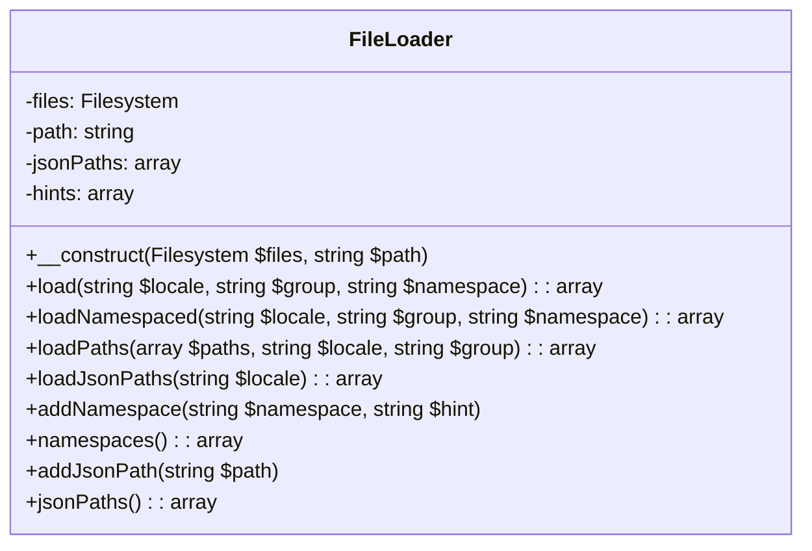
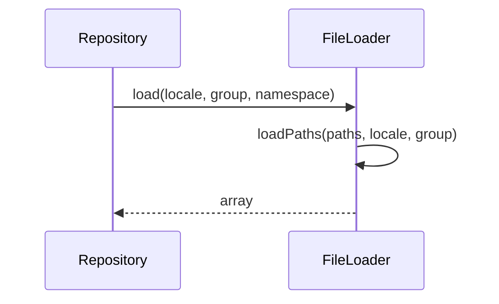

## FileLoader

### Outline of properties and methods

*   `$files`: `Illuminate\Filesystem\Filesystem` - The filesystem instance.
*   `$path`: `string` - The default path for the loader.
*   `$jsonPaths`: `array` - All of the registered paths to JSON translation files.
*   `$hints`: `array` - All of the namespace hints.
*   `__construct(Filesystem $files, $path)`: Constructor.
*   `load($locale, $group, $namespace = null)`: Load the messages for the given locale.
*   `loadNamespaced($locale, $group, $namespace)`: Load a namespaced translation group.
*   `loadPaths(array $paths, $locale, $group)`: Load a locale from a given path.
*   `loadJsonPaths($locale)`: Load a locale from the given JSON file path.
*   `addNamespace($namespace, $hint)`: Add a new namespace to the loader.
*   `namespaces()`: Get an array of all the registered namespaces.
*   `addJsonPath($path)`: Add a new JSON path to the loader.
*   `jsonPaths()`: Get an array of all the registered paths to JSON translation files.

### Mermaid class diagram

### Mermaid sequence diagram

