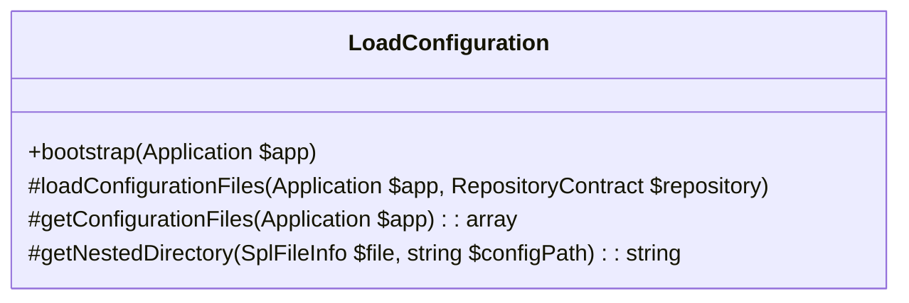
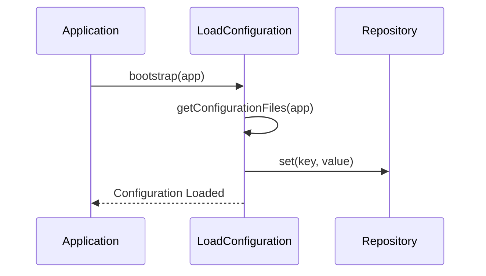
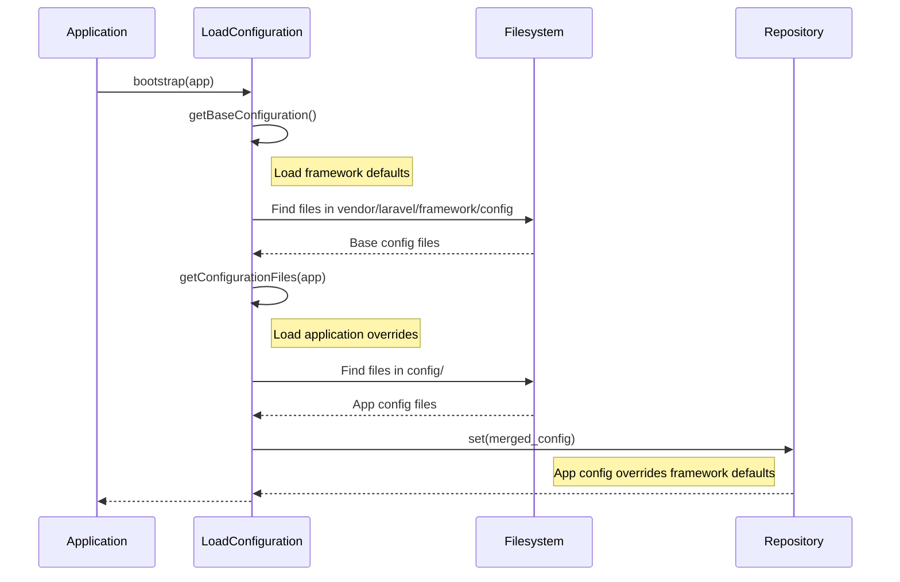

## LoadConfiguration

### Outline of properties and methods

*   `bootstrap(Application $app)`: Bootstrap the given application.
*   `loadConfigurationFiles(Application $app, RepositoryContract $repository)`: Load the configuration items from all of the files.
*   `getConfigurationFiles(Application $app)`: Get all of the configuration files for the application.
*   `getNestedDirectory(SplFileInfo $file, string $configPath)`: Get the configuration file nesting path.

### Mermaid class diagram



### Mermaid sequence diagram



### Detailed Configuration Loading Sequence

This diagram illustrates the full process of how `LoadConfiguration` loads both framework default configuration and application-specific configuration, and how they are merged.



### Configuration File Examples

These examples illustrate how configuration files from the framework and your application interact.

#### 1. Framework Default `app.php` (Simplified)

This would typically be found in `vendor/laravel/framework/config/app.php`. It provides the default settings for a Laravel application.

```php
<?php

return [
    'name' => 'Laravel',
    'env' => 'production',
    'debug' => false,
    'url' => 'http://localhost',
    'timezone' => 'UTC',
    'locale' => 'en',
    'fallback_locale' => 'en',
    'key' => 'SomeRandomString', // This would be a long, random string
    // ... many other default settings
];
```

#### 2. Application Override `app.php` (Simplified)

This file would be located in your project's `config/app.php`. It overrides specific values from the framework's default, often using environment variables (`env()`). Values not present here will fall back to the framework's defaults.

```php
<?php

return [
    'name' => env('APP_NAME', 'My Custom App'), // Overrides 'Laravel'
    'env' => env('APP_ENV', 'local'),         // Overrides 'production'
    'debug' => env('APP_DEBUG', false),       // Overrides 'false'
    'url' => env('APP_URL', 'http://localhost:8000'), // Overrides 'http://localhost'
    'timezone' => 'America/New_York',         // Overrides 'UTC'
    // 'locale' and 'fallback_locale' are not defined here,
    // so they will use the framework's default values ('en').
    'key' => env('APP_KEY'), // Typically set via .env
];
```