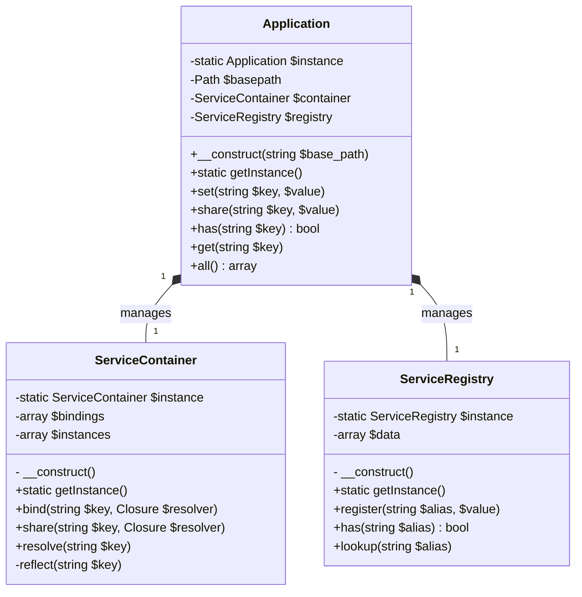
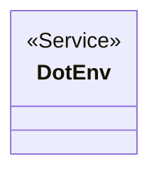
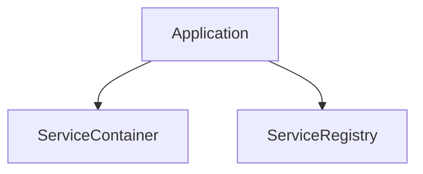
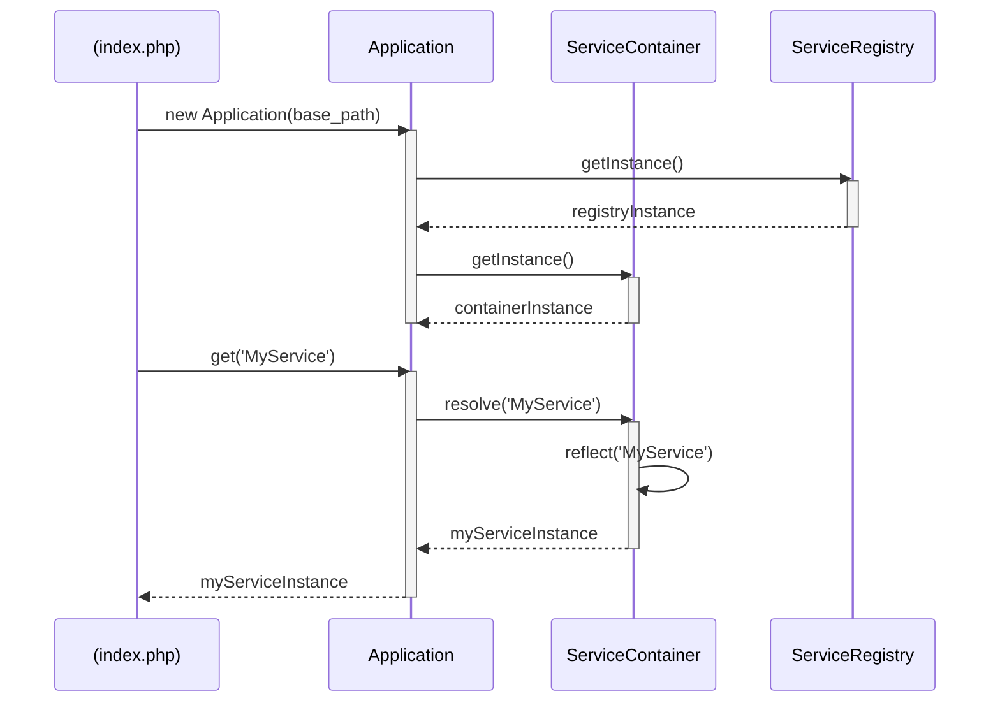
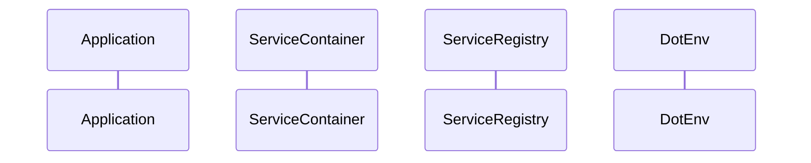

# Foundation Workflow

This document outlines the architecture and interaction of the core foundation classes: `Application`, `ServiceContainer`, and `ServiceRegistry`.

## 1. Class Diagrams

This diagram shows the properties, methods, and relationships between the core classes.

### 1.1 Application Structure

### 1.2 DotEnv

## 2. Organizational Charts

This chart illustrates the ownership and instantiation hierarchy. The `Application` class is the entry point and is responsible for creating and managing the container and registry instances.

## 3. Sequence Diagrams

### 3.1 Instantiation Phase

This diagram shows the typical sequence of events during application boot-up and when resolving a service from the container.

### 3.2 Configuration Phase

