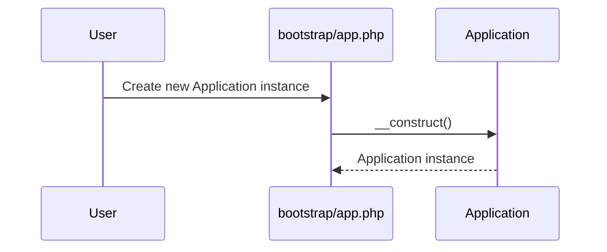
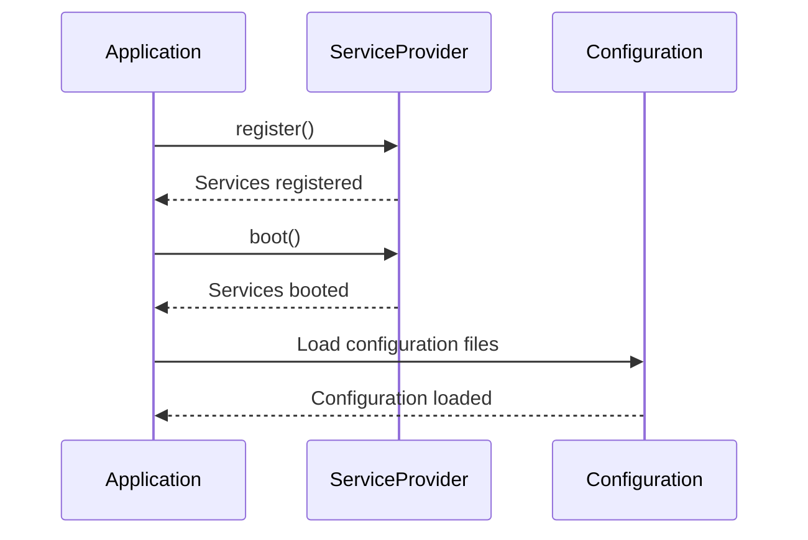

# Laravel Application Instantiation Lifecycle

This document provides a high-level overview and sequence diagrams of the Laravel application instantiation lifecycle, from the creation of the `Application` instance in `bootstrap/app.php` to the loading of configurations and services.

## High-Level Overview

1.  **`bootstrap/app.php`:** The application lifecycle begins here. A new instance of `Illuminate\Foundation\Application` is created.
2.  **Core Bindings:** The `Application` class binds several core components into the service container. This includes the application instance itself, the container, and other essential services.
3.  **Service Provider Registration:** The application registers the base service providers defined in the `config/app.php` configuration file.
4.  **Service Provider Booting:** After all service providers have been registered, they are "booted". This allows service providers to depend on other registered providers.
5.  **Configuration Loading:** The application loads the configuration files from the `config` directory.
6.  **Service Loading:** The application loads services from the registered service providers.

## Sequence Diagrams

### 1. Application Instantiation

### 2. Configuration and Service Loading

