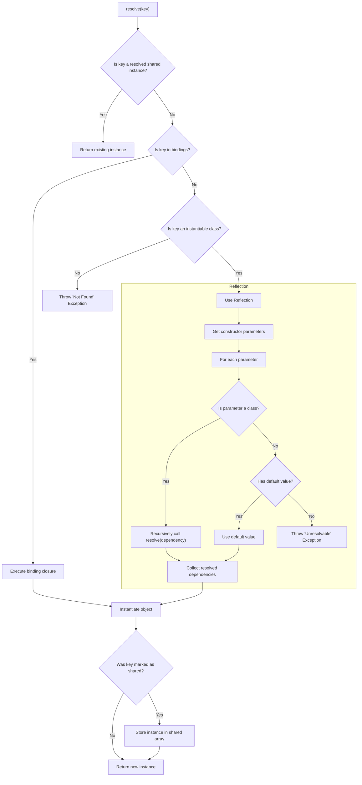

```mermaid
graph TD
    A["resolve(key)"] --> B{"Is key a resolved shared instance?"};
    B -- "Yes" --> C["Return existing instance"];
    B -- "No" --> D{"Is key in bindings?"};
    D -- "Yes" --> E["Execute binding closure"];
    E --> F["Instantiate object"];
    D -- "No" --> G{"Is key an instantiable class?"};
    G -- "No" --> H["Throw 'Not Found' Exception"];
    G -- "Yes" --> I["Use Reflection"];
    I --> J["Get constructor parameters"];
    J --> K["For each parameter"];
    K --> L{"Is parameter a class?"};
    L -- "Yes" --> M["Recursively call resolve(dependency)"];
    L -- "No" --> N{"Has default value?"};
    N -- "Yes" --> O["Use default value"];
    N -- "No" --> P["Throw 'Unresolvable' Exception"];
    M --> Q["Collect resolved dependencies"];
    O --> Q;
    Q --> F;
    F --> R{"Was key marked as shared?"};
    R -- "Yes" --> S["Store instance in shared array"];
    R -- "No" --> T["Return new instance"];
    S --> T;

    subgraph "Reflection"
        I
        J
        K
        L
        M
        N
        O
        P
        Q
    end
```
