# The Registry Design Pattern

The Registry is a simple but powerful design pattern for managing application-wide information. This document outlines its purpose, how it differs from other patterns like a Service Container, and the best practices for implementing a robust registry system.

## 1. The Role of a Registry

### What is a Registry?

A Registry is essentially a globally accessible container for shared data, configuration, and values. Think of it as a centralized "phone book" or "bulletin board" for your application. Any part of the application can look up a piece of information (like a database host name or an API key) without having to know where that information originated. Its primary goal is to provide a single, predictable source of truth for application-level settings.

### Registry vs. Service Container: A Critical Distinction

This is one of the most important distinctions in framework architecture. While both are central containers, they have fundamentally different responsibilities.

**A Service Registry holds *data* and *configuration*.**
*   **Purpose:** To store and retrieve simple, often serializable, information.
*   **Content:** Database host names, API keys, application-wide settings (like `debug_mode`), paths, arrays of configuration, etc.
*   **Answers the question:** "What is the setting for X?" (e.g., "What is the database port?").

**A Service / DI Container holds *live service objects* and manages their *dependencies*.**
*   **Purpose:** To construct, manage, and retrieve complex objects and their entire dependency graph. It handles object lifecycles (e.g., creating a "singleton" that is shared everywhere).
*   **Content:** Live database connection objects, logger instances, request/response objects, and other complex services that perform actions.
*   **Answers the question:** "Give me a tool that can do Y." (e.g., "Give me a fully configured Logger object.").

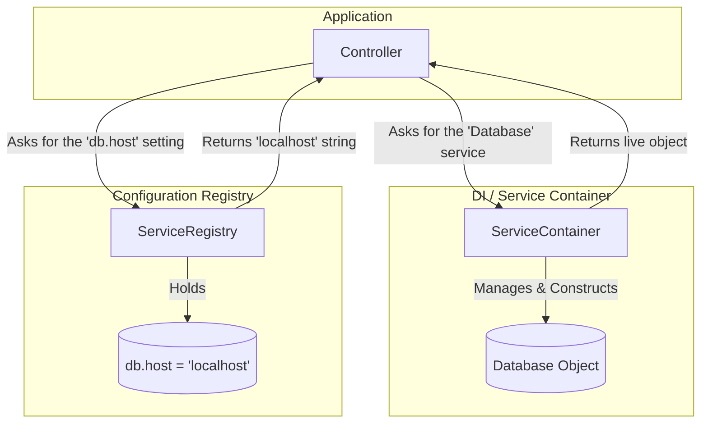

### What a Registry Accomplishes
*   **Centralization:** Provides one place to find application settings.
*   **Decoupling:** Components no longer need to hard-code configuration values or know how to read specific config files. They just ask the registry.
*   **Single Source of Truth:** Prevents configuration drift and ensures all parts of the application are working with the same settings.

---

## 2. Best Practices and Conventions

A well-designed registry follows a simple, predictable API.

### Core Properties
At its heart, a registry needs a place to store its data. A private associative array is the most common implementation.
*   `private array $data = [];`

### Core Methods
The public API should be simple and mirror basic CRUD (Create, Read, Update, Delete) operations.
*   `register(string $alias, mixed $value, ...)`: To add an item in the registry using a string-based key or "alias".
*   `lookup(string $alias): mixed`: To retrieve an item from the registry by its alias.
*   `has(string $alias): bool`: To check for an item's existence.

### Data Flow Diagram

This sequence diagram shows the basic data flow for registering and looking up a simple value.

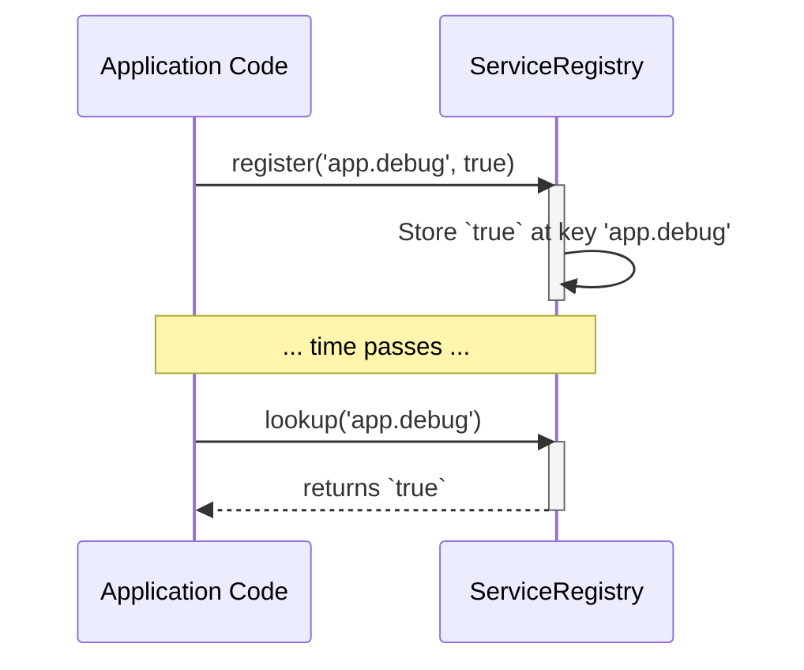

---

## 3. Building a Robust System: Affiliated Classes

Storing simple key-value pairs is good, but a truly robust registry stores richer information. This is accomplished with helper classes.

### Beyond Simple Key-Value: The `RegistryItem`
Instead of storing the raw value directly, we wrap it in a `RegistryItem` object. This object acts as a container, holding both the value and its metadata. This prevents the registry from being a simple "junk drawer" and gives structure to every entry.

### Describing the Data: The `RegistryMetaData`
This is the most important affiliated class. For every `RegistryItem`, we attach a `RegistryMetaData` object. This object's sole purpose is to hold structured information *about* the value. It answers questions like:
*   What is this value's data type?
*   What category does it belong to?
*   Is it read-only?
*   What is it for? (description)

### Class Diagram

This diagram shows how the classes relate to each other. The `ServiceRegistry` holds many `RegistryItem` objects, and each `RegistryItem` has exactly one `RegistryMetaData` object.

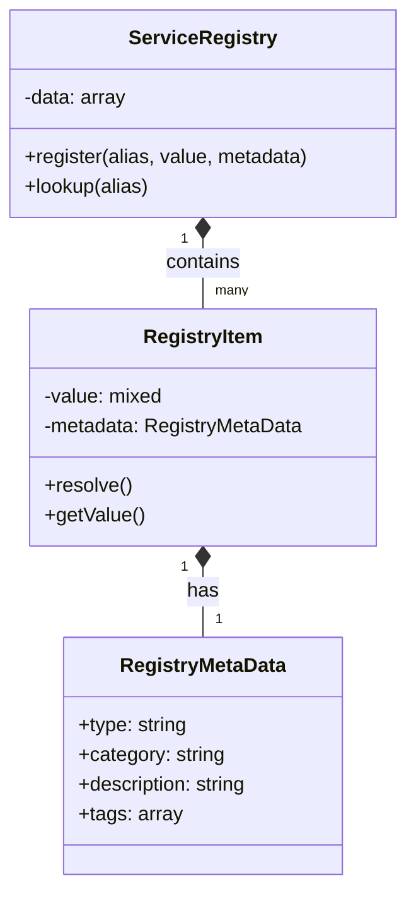

#### Rationale for Immutability

In this design, both `RegistryItem` and `RegistryMetaData` should be treated as immutable Value Objects.

*   **Why `RegistryMetaData` must be immutable:** This object holds the **instructions** (like `type` and `category`) for how to process the raw value. If these instructions could be changed after registration, it would lead to unpredictable behavior and violate the "single source of truth" principle. Its value is defined by its properties, and that value must not change.

*   **Why `RegistryItem` must be immutable:** This object represents a complete entry in the registry, bundling the value and its metadata. If the `RegistryItem` itself were mutable, you could change its underlying value or metadata after it has been registered (e.g., `$item->setValue(...)`). This would directly mutate the state within the registry, which is the exact "action at a distance" problem that a robust registry seeks to prevent.

### Deeper Dive: Approaches to Item and Metadata Storage

#### Approach 1: Simple Arrays (The Convention-over-Configuration approach)

Many successful frameworks (like Laravel and Symfony) use simple nested associative arrays for their configuration registries. The "item" and its "metadata" are not distinct objects, but rather conventions within the array structure.

*   **Pros:** Extremely fast, low memory overhead, simple to debug with `print_r`.
*   **Cons:** Relies entirely on developer convention. There is no type safety, no defined structure, and no way to enforce what keys are valid. It is prone to typos.

#### Approach 2: Value Objects (The API-over-Convention approach)

The design we have explored with `RegistryItem` and `RegistryMetaData` follows the **Value Object** pattern. This approach provides a formal, structured API for every entry in the registry.

*   **Pros:** Provides structure and type safety. The class definition becomes self-documenting. The API is explicit and less prone to user error. Allows for methods on the items themselves (like `resolve()`).
*   **Cons:** More boilerplate code to write up front. Slightly more memory usage (often negligible).

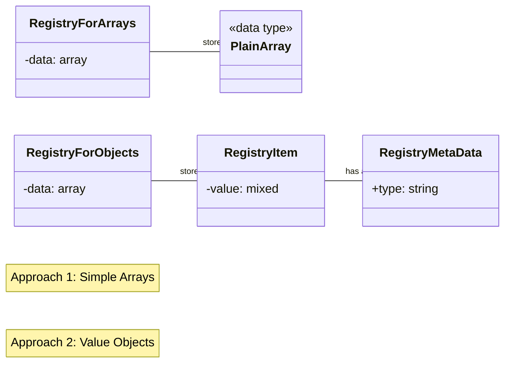

#### Best Practices and Underlying Concepts

When using the Value Object approach, the goal is to create a more robust and predictable system. The underlying computer science concepts are:

*   **Data Abstraction & Encapsulation:** The `RegistryItem` object hides the complexity of its internal structure. You interact with it through a clean API (`getValue()`, `resolve()`), not by accessing raw array keys. This prevents you from depending on a fragile internal structure.
*   **Self-Documentation:** The class definitions for `RegistryItem` and `RegistryMetaData` form a contract. A developer can read the class to understand exactly what a registry entry consists of. This is impossible with a simple array.
*   **Immutability:** For maximum safety, Value Objects should be **immutable**. Once a `RegistryItem` is created, it should not be changed. Any modification should result in a new `RegistryItem` instance. This prevents bugs from "action at a distance" where one part of the code unintentionally modifies a configuration object used by another.

#### Verifying Immutability

While immutability is a design discipline, you can programmatically check if a class instance adheres to the common conventions of an immutable value object using PHP's Reflection API. A reliable test would check for the following characteristics:

*   **Is the class `final`?** It should be, to prevent mutable subclasses that could violate the contract.
*   **Are all properties `readonly` (PHP 8.1+)?** This is the strongest indicator of immutability.
*   **If not `readonly`, are all properties `private`?** This prevents direct external modification.
*   **Does it lack public "setter" methods?** The class should not provide any public methods for changing its state (e.g., methods conventionally named `set...`).
*   **Does it have an `equals()` method?** A true value object should define its own equality based on its properties, not its identity.

---

## 4. Design Philosophies

The architecture of a registry revolves around a few key philosophies.

### Generic vs. Specialized
*   A **Generic Registry** (like the one we've designed) is a general-purpose tool that can store anything. Because it has no specific knowledge of the data it holds, it requires explicit instructions from the developer.
*   A **Specialized Registry** (e.g., a `FileSystemRegistry`) is an expert on a narrow domain. It can have "smart" methods with built-in logic (e.g., a `registerPath()` method that knows how to tell a file from a directory). Powerful systems often use specialized facades that use a generic registry internally.

### Instructive vs. Descriptive Metadata
This is the most critical philosophy for a generic registry.
*   **Descriptive:** Stating what a value *is* right now (e.g., `gettype('8080')` returns `'string'`). This is not very useful, as the registry can't guess your intent.
*   **Instructive:** Telling the registry what you *want the value to become*. This is the correct approach for a generic registry. By providing `['type' => 'int']`, you are giving the registry the **instruction** it needs to transform the raw value `'8080'` into the usable integer `8080`.

### The `resolve()` Method: Hydration and Transformation

The `resolve()` method is the engine that acts on the instructive metadata. Its job is to transform the raw, stored value into its final, usable form. This process is often called **Hydration**—taking "dry" data (like a string) and adding the "water" (class logic, type casting) to bring it to life.

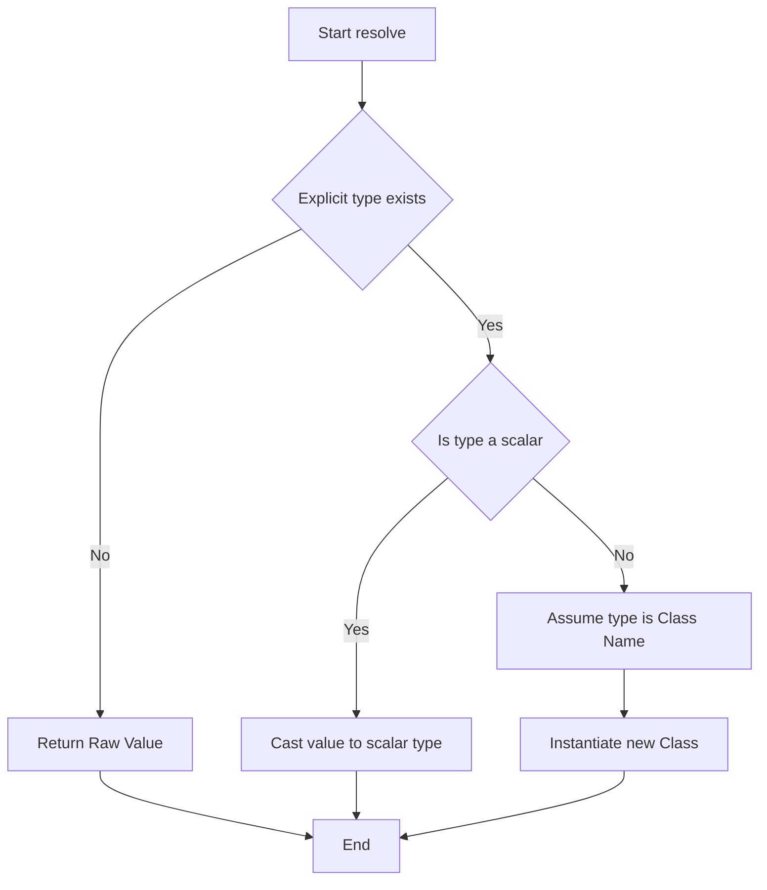

---

## 5. Related Design Patterns

The concepts we've discussed touch upon several other formal design patterns.

### The Singleton Pattern
A Registry is almost always implemented as a **Singleton**.
*   **Purpose:** To ensure that a class has only one instance and to provide a single, global point of access to it.
*   **How it relates:** The `getInstance()` method is the classic implementation of the Singleton pattern. This guarantees that all parts of your application are accessing the exact same registry.

### Service Locator
This is a very closely related pattern.
*   **Purpose:** A Service Locator is a registry that is specifically used to find and return **service objects**.
*   **How it relates:** If you were to use your `ServiceRegistry` to store and retrieve live service objects, you would be using it as a **Service Locator**.
*   **Key Difference:** With a Service Locator, the client code actively asks for its dependencies (`$db = Registry::lookup('database');`). With Dependency Injection, the dependencies are passively given to the client, usually in its constructor.

### Factory Method Pattern
The `resolve()` method we designed is a perfect example of a **Factory Method**.
*   **Purpose:** To define an interface (or method) for creating an object, but letting the metadata alter the type of object that will be created.
*   **How it relates:** The `resolve()` method's job is to "manufacture" the final value. It reads the `type` instruction and decides whether to manufacture an `int`, a `string`, or a `new File()` object.

### Value Object
The `RegistryItem` and `RegistryMetaData` classes are examples of **Value Objects**.
*   **Purpose:** A simple object that represents a descriptive aspect of the domain with no conceptual identity. Their equality is based on their value, not their identity.
*   **How it relates:** A `RegistryMetaData` object holding `type: 'int'` is equal to any other `RegistryMetaData` object holding `type: 'int'`. They are simple, structured containers for data.

### Summary Table: Registry vs. Related Concepts

| Pattern | Purpose | Typical Content | How Dependencies are Handled |
| :--- | :--- | :--- | :--- |
| **Registry** | Store & retrieve configuration/data. | Strings, numbers, arrays, config. | Does not manage dependencies. |
| **Service Locator** | Find & retrieve service objects. | Live service objects. | Client actively requests services. |
| **DI Container** | Create & manage service objects. | Service definitions & live objects. | Dependencies are injected into clients. |

---

## 6. Hierarchical Structure and Dot-Notation

While a registry can be a simple, flat key-value store, its power is greatly enhanced by organizing entries into a hierarchy. This is analogous to how a filesystem uses folders to organize files. The most common convention for this is **dot-notation**.

### The Dot-Notation Convention

The convention is to structure keys like a path, with each level separated by a dot.

`level1.level2.level3.key`

This creates logical groups and makes the configuration self-documenting.

*   `database.mysql.host`
*   `database.mysql.port`
*   `cache.redis.host`
*   `app.debug_mode`

This practice avoids naming collisions and makes it easy to find related settings.

### What is this Pattern Called?

Using dot-notation to access a nested data structure is not a single, formal design pattern but rather a practical application of several computer science concepts:

*   **Tree Data Structure:** The hierarchy itself is a tree, where each dot represents descending one level.
*   **Associative Arrays (Hash Maps):** The underlying implementation is typically a tree of nested associative arrays.
*   **Namespacing:** Most importantly, dot-notation provides **namespaces** for your configuration. The `database.mysql` part acts as a namespace for all MySQL-related settings, preventing a conflict with `cache.redis.host`.

### Naming Conventions and Conflict Avoidance

*   **Conflict Avoidance:** The best way to avoid conflicts is to use well-defined, unique top-level keys (e.g., `app`, `database`, `cache`, `services`). For third-party modules, a common practice is to use a vendor namespace, similar to package managers: `vendor.package.setting`.
*   **Syntax Conventions:** The segments of the key should be consistent. Common conventions are `snake_case` (e.g., `app.debug_mode`, common in PHP) and `kebab-case` (e.g., `app.debug-mode`, common in YAML). The key is to pick one and stick to it.

### Querying and Searching Hierarchies

A powerful registry allows you to retrieve not just single values, but entire branches of the hierarchy.

*   **Strategy 1: Exact Match:** Retrieving a single leaf node value. This is the standard `lookup()`.
*   **Strategy 2: Section Retrieval:** Retrieving an entire "directory" of settings. A call like `lookup('database.mysql')` should return an array of all settings under that namespace: `['host' => ..., 'port' => ...]`. This allows a component to grab all the configuration it needs in one call.
*   **Strategy 3: Wildcard Search (Advanced):** Some systems allow for wildcard searches, like `lookup('database.*.host')`. This is powerful but complex to implement efficiently, often requiring a full traversal of the configuration tree.

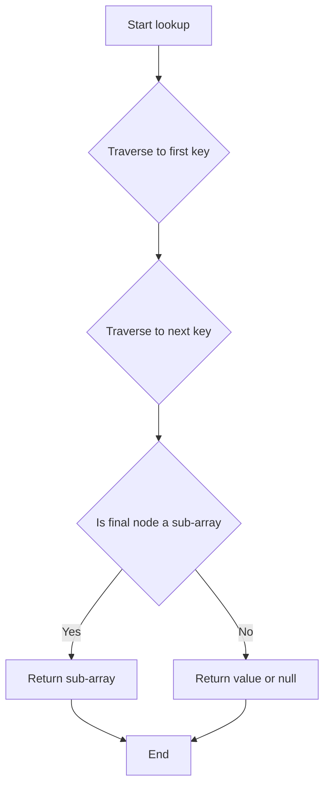

### Implementation Data Flow

To implement this, the `register()` method must parse the alias and recursively build the nested array structure.

```php
// A simplified look inside register('database.mysql.host', '127.0.0.1')

$keys = explode('.', 'database.mysql.host');
// $keys is ['database', 'mysql', 'host']

$temp = &$this->data; // Start with a reference to the main data array

// Loop through keys, stopping before the last one
while (count($keys) > 1) {
    $key = array_shift($keys);
    if (!isset($temp[$key]) || !is_array($temp[$key])) {
        $temp[$key] = []; // Create the nested array if it doesn't exist
    }
    // Move the reference down one level
    $temp = &$temp[$key];
}

// Assign the value to the final key
$temp[array_shift($keys)] = $value;
```

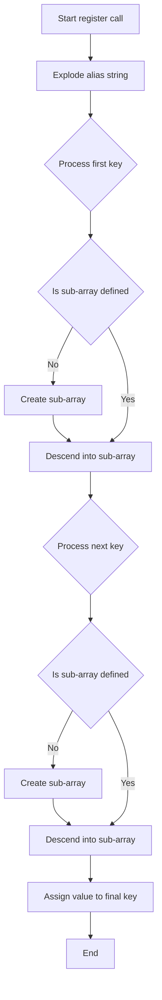

### Enforcing the Hierarchy

Strictly enforcing a schema is complex. The best approach is usually a combination of:

1.  **Convention and Documentation:** Clearly document the expected configuration structure. This is the most common method.
2.  **Schema Validation:** For highly critical applications, you can validate a new entry against a predefined schema array before storing it.
3.  **Specialized Methods:** Create methods like `registerDbSetting($driver, $key, $value)` which build the alias `database.$driver.$key` internally. This provides a structured API that prevents incorrect aliases.

#### A Deeper Dive: Specialized Methods for API-Driven Structure

This pattern provides a structured, safe API for setting configuration in specific, well-known parts of the hierarchy. Instead of relying on the user to correctly type `database.mysql.host`, you provide a dedicated method that builds the alias internally.

This shifts the responsibility of creating the correct alias from the user to the registry itself, making the API less error-prone and more self-documenting. It is a form of the **Fluent Interface** or **Builder** pattern.

**Best Practices**
*   **Be Specific:** Each method should map to a clear, top-level namespace (e.g., `database`, `cache`).
*   **Use Clear Parameters:** The method signature should enforce the structure. `registerDatabaseSetting(string $driver, string $key, mixed $value)` is much clearer than `register(string $alias, ...)`. 
*   **Return `$this`:** Returning the registry instance from these methods allows for a "fluent" chain of calls: `$registry->setDb(...)->setCache(...);`.
*   **Validate Inputs:** The specialized method is the perfect place to validate parameters, e.g., ensuring `$driver` is one of the supported database drivers.

**Sample PHP Code**

```php
// Add this method to your ServiceRegistry class

/**
 * Registers a database setting using a structured, safe API.
 *
 * @param string $driver e.g., 'mysql', 'postgres'
 * @param string $key e.g., 'host', 'port'
 * @param mixed $value The setting value.
 * @param array $metadata Optional metadata.
 * @return self
 */
public function registerDatabaseSetting(string $driver, string $key, mixed $value, array $metadata = []): self
{
    // Build the alias internally, ensuring correctness
    $alias = "database.{$driver}.{$key}";

    // Call the main generic register method
    $this->register($alias, $value, $metadata);

    // Return $this for a fluent interface
    return $this;
}

// --- Usage ---
$registry->registerDatabaseSetting('mysql', 'host', '127.0.0.1');
```

**Diagrams**

*Class Diagram: Shows the new method on the class.*
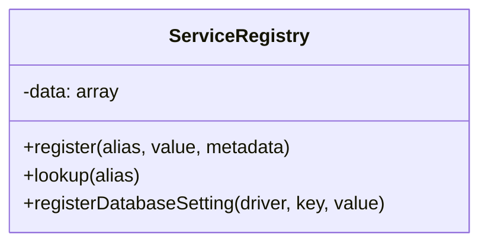

*Sequence Diagram: Shows the internal delegation.*
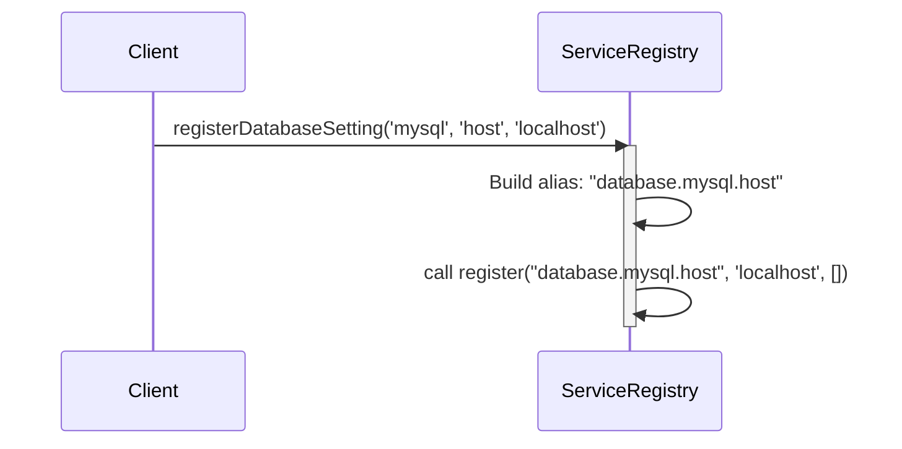

**References in Other Systems**

While not always for registries, this pattern of providing structured setters is common in SDKs and configuration builders.

*   **SDK Clients (AWS, Google Cloud):** When creating a client object, you often pass a structured configuration array or use a builder pattern, e.g., `new S3Client(['region' => 'us-east-1'])`. This is safer than asking the user to build a complex configuration string.
*   **Fluent Interface Builders:** Many libraries use this to build complex objects or configurations. For example, query builders in database libraries: `$query->select('id')->from('users')->where('name', 'sally');`. Each method is a specialized setter that builds part of a larger internal structure.

---

## 7. Origins and Computer Science Concepts

### Conceptual Origins

The idea of a central place for configuration is as old as complex software itself.

*   **The Windows Registry:** As you mentioned, this is a famous (and famously complex) example. It provides a hierarchical database for the entire operating system and its applications to store settings, from hardware configurations to user preferences.
*   **UNIX/Linux Configuration Files:** The concept is also embodied by files in `/etc`, and by application-specific `.ini` or `.conf` files. These often use sections `[section]` and key-value pairs, which is a form of hierarchy that a dot-notation registry emulates in memory.
*   **macOS Property Lists (`.plist`):** These are XML or binary files that store nested key-value data, serving a similar purpose for macOS and iOS applications.

### Core Computer Science Concepts

*   **Hash Table (Associative Array):** This is the fundamental data structure that makes a registry efficient. A hash table provides, on average, constant-time O(1) complexity for lookups, insertions, and deletions. Our registry is essentially a tree of nested hash tables.
*   **Global State:** A Singleton Registry is a form of **managed global state**. This is a significant architectural decision. 
    *   **Pros:** Unmatched convenience and a single, predictable point of access for universal constants and settings.
    *   **Cons:** Can make unit testing harder, as tests can't easily swap in their own configuration. It can hide the dependencies of a class, as the class can just reach out to the global registry at any time.
    *   Using a Registry is a conscious trade-off, accepting the risks of global state for the convenience of accessing ubiquitous configuration.

### Implementations in PHP Frameworks

Most major PHP frameworks use this pattern for configuration.

*   **Laravel:** Laravel's `config()` helper function and `Config` facade are a classic Registry implementation. Configuration is loaded from `.php` files in the `config/` directory into a central repository.
    ```php
    // Get the application name
    $appName = config('app.name');

    // Get the MySQL database host
    $dbHost = config('database.connections.mysql.host');
    ```

*   **Symfony:** Symfony uses a `ParameterBag` within its main Dependency Injection Container. Parameters are defined in configuration files (e.g., `services.yaml`) and are accessed via the container.
    ```php
    # In services.yaml
    parameters:
        app.debug_mode: true

    # In a service or controller
    $isDebug = $container->getParameter('app.debug_mode');
    ```

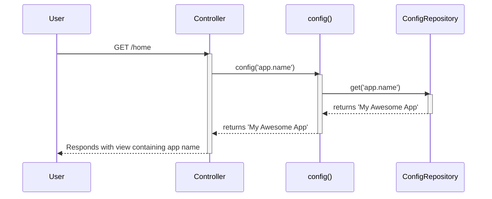

---

## 8. Appendix: Questions

### How do you enforce immutability of a RegistryItem object once it is registered?

Based on the document, the key principle is that any modification should result in a **new** `RegistryItem` instance, rather than changing the original one.

You enforce this in PHP through a combination of three techniques:

1.  **Make properties private:** This prevents direct modification from outside the class.
2.  **Initialize all properties in the constructor:** The object is created in its complete and final state.
3.  **Omit setters, use "withers":** Instead of methods that change properties (like `setValue()`), you create methods that return a *new* instance of the object with the updated value. These are often called "wither" methods (e.g., `withValue()`).

Here is a code example of how the `RegistryItem` class could be implemented to be immutable:

```php
final class RegistryItem
{
    public function __construct(
        private readonly mixed $value,
        private readonly RegistryMetaData $metadata
    ) {
        // Properties are initialized here and cannot be changed.
        // Using 'readonly' provides an extra layer of enforcement.
    }

    public function getValue(): mixed
    {
        return $this->value;
    }

    public function getMetadata(): RegistryMetaData
    {
        return $this->metadata;
    }

    /**
     * Returns a NEW RegistryItem with a different value.
     * The original object is not modified.
     */
    public function withValue(mixed $newValue): self
    {
        // Create and return a new instance with the new value
        return new self($newValue, $this->metadata);
    }
}
```

With this implementation, once a `RegistryItem` is created and registered, it cannot be altered. Any attempt to "change" it just gives you back a completely new object, preserving the integrity of the original.

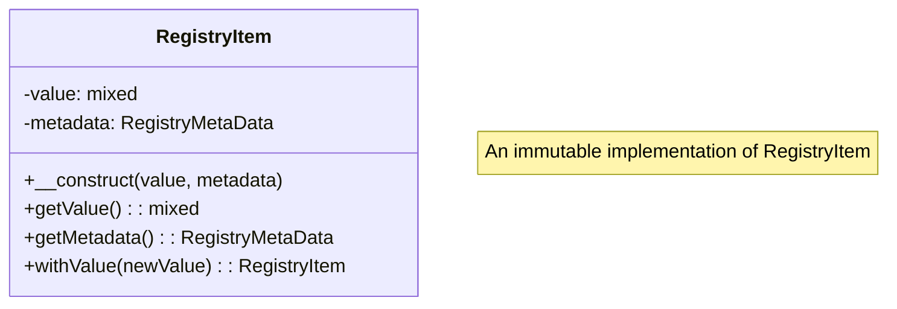

### What if that object - when pulled by lookup() is unserialized / hydrated (or an array has an element added to it)? Does the serialized form of that object in the registry change also? What is best practice concerning this?

That's an excellent question. This touches on the lifecycle of a configuration value and the difference between the stored data and the in-memory representation.

The short answer is: **No, the original serialized form in the registry does not change.**

#### The Hydration/Unserialization Process is One-Way

Think of the process as a one-way factory assembly line:

1.  **Storage:** The registry stores the "raw material"—a serialized string, a simple array from a config file, or some other "dry" data.
2.  **Lookup & Hydration:** When you call `lookup('some.value')`, the registry's `resolve()` method acts as a factory. It takes the raw material and *builds a brand new object* from it. This is hydration/unserialization.
3.  **Return:** The registry gives you the newly created object.

The crucial point is that the finished product (the hydrated object) has **no link back to the raw material** (the serialized string). Modifying the object you received is like drawing a mustache on a car that just came off the assembly line; it doesn't change the factory's blueprint or the next car that gets made.

The same is true for arrays. When `lookup()` returns an array, PHP gives you a **copy** of that array. Adding an element to your copy does not affect the original array stored in the registry.

#### What is the Best Practice?

This behavior leads to a critical best practice: **Treat configuration as read-only and stateless.**

1.  **Configuration is for Reading, Not Writing:** The registry's purpose is to provide a consistent source of truth for configuration that is established when the application boots. It is not designed to be a place to store and manage application *state* that changes during a request.

2.  **Avoid In-Memory State Drift:** If you hydrate an object, modify it, and then another part of the application looks up and hydrates the *same* configuration value, it will get a *new, clean* object based on the original raw data. The two parts of your application would now have different versions of the "same" configuration, which is a recipe for subtle and hard-to-find bugs.

3.  **`resolve()` Should Always Return a Fresh Instance:** To enforce this read-only nature, the `resolve()` method should ideally perform the hydration every time it's called for a non-scalar value. This ensures that every part of the code gets a fresh, identical object, preventing one component from modifying a shared object and affecting another (the "action at a distance" problem in a new form).

**In summary:** If you need to manage data that changes, you should use a dedicated state management service, a database, or a cache—not the configuration registry. The registry should remain a pristine, read-only source of the application's initial setup.
