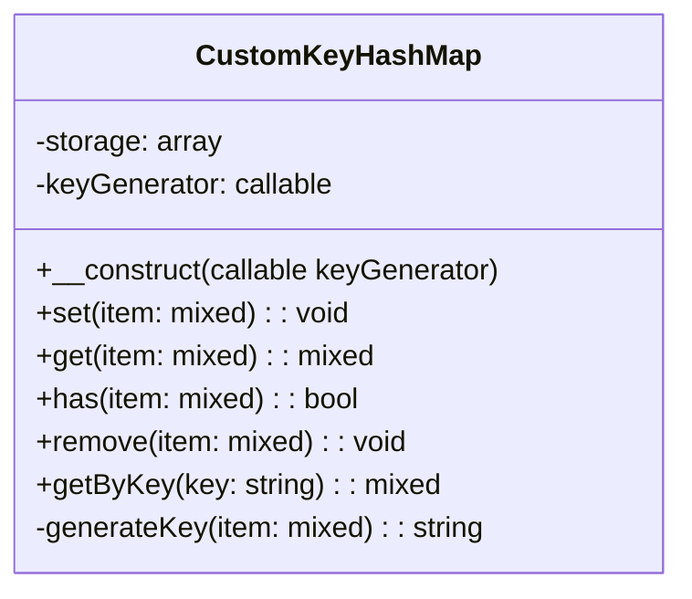
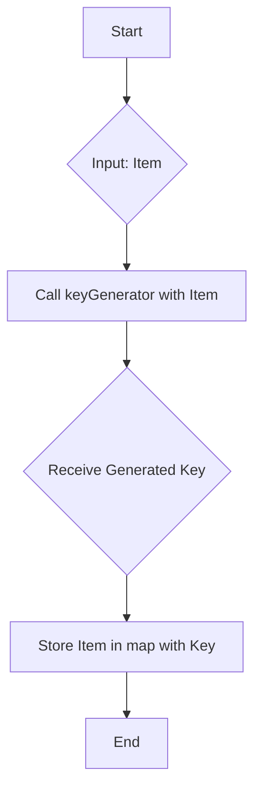
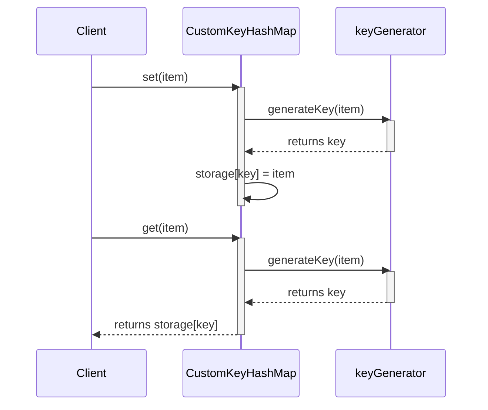

# Hash Map with Custom Key Generation

## Overview

A "Hash Map with Custom Key Generation" is a data structure that combines the fast look-up capabilities of a traditional hash map (or associative array) with a flexible, user-defined mechanism for generating keys. Instead of relying on standard data types like strings or integers for keys, this structure generates a unique key from the object or data being stored itself, based on a provided logic or function.

This is particularly useful when you need to store and retrieve objects in a map based on their content or a combination of their properties, rather than a simple, pre-existing identifier.

## Description of Concepts

### Hash Map
A hash map is a data structure that stores key-value pairs. It uses a hash function to compute an index into an array of buckets or slots, from which the desired value can be found. This allows for average-case constant-time (`O(1)`) lookups, insertions, and deletions. In PHP, associative arrays provide this functionality.

### Custom Key Generation
Custom key generation involves creating a unique identifier (the key) for an object based on its properties. This is done via a user-supplied function or algorithm (a "generator"). For example, for a `User` object, the key could be a combination of the user's `id` and `email`, or a hash of the object's state.

## Class Outline

Here is a conceptual outline for a `CustomKeyHashMap` class.

### Properties
- `storage` (private): An associative array (the hash map) to hold the key-value pairs.
- `keyGenerator` (private): A `callable` (like a closure or function name) that accepts an item and returns a string or integer key.

### Methods
- `__construct(callable $keyGenerator)`: The constructor, which requires a key generation function to be provided.
- `set(mixed $item)`: Takes an item, uses the `keyGenerator` to create a key, and stores the item in the `storage` array.
- `get(mixed $item)`: Takes an item, generates the key, and returns the corresponding item from storage if it exists.
- `has(mixed $item)`: Takes an item, generates the key, and checks if an entry with that key exists.
- `remove(mixed $item)`: Takes an item, generates the key, and removes the key-value pair from storage.
- `getByKey(string $key)`: Retrieves an item directly by its key, bypassing the generation logic.

## Sample Code (PHP)

```php
<?php

class CustomKeyHashMap
{
    /**
     * @var array The internal storage for the hash map.
     */
    private $storage = [];

    /**
     * @var callable A function to generate a unique key from an item.
     */
    private $keyGenerator;

    /**
     * Constructor.
     *
     * @param callable $keyGenerator A function that takes an item and returns a string key.
     */
    public function __construct(callable $keyGenerator)
    {
        $this->keyGenerator = $keyGenerator;
    }

    /**
     * Generates a key for the given item.
     *
     * @param mixed $item
     * @return string
     */
    private function generateKey($item): string
    {
        return ($this->keyGenerator)($item);
    }

    /**
     * Adds an item to the map.
     *
     * @param mixed $item The item to add.
     */
    public function set($item): void
    {
        $key = $this->generateKey($item);
        $this->storage[$key] = $item;
    }

    /**
     * Checks if an item exists in the map.
     *
     * @param mixed $item The item to check.
     * @return bool
     */
    public function has($item): bool
    {
        $key = $this->generateKey($item);
        return isset($this->storage[$key]);
    }

    /**
     * Retrieves an item from the map.
     *
     * @param mixed $item The item to retrieve.
     * @return mixed|null The stored item or null if not found.
     */
    public function get($item)
    {
        $key = $this->generateKey($item);
        return $this->storage[$key] ?? null;
    }

    /**
     * Removes an item from the map.
     *
     * @param mixed $item The item to remove.
     */
    public function remove($item): void
    {
        $key = $this->generateKey($item);
        if (isset($this->storage[$key])) {
            unset($this->storage[$key]);
        }
    }

    /**
     * Retrieves an item by its pre-computed key.
     *
     * @param string $key
     * @return mixed|null
     */
    public function getByKey(string $key)
    {
        return $this->storage[$key] ?? null;
    }
}

// --- Usage Example ---

// Define a simple class
class User
{
    public $id;
    public $username;

    public function __construct(int $id, string $username)
    {
        $this->id = $id;
        $this->username = $username;
    }
}

// Create a key generator function
$userKeyGenerator = function(User $user): string {
    return 'user_' . $user->id . '_' . $user->username;
};

// Instantiate the map with our custom generator
$userMap = new CustomKeyHashMap($userKeyGenerator);

$user1 = new User(101, 'alice');
$user2 = new User(102, 'bob');

// Add users to the map
$userMap->set($user1);
$userMap->set($user2);

// Check if a user exists
var_dump($userMap->has($user1)); // bool(true)

// Retrieve a user
$retrievedUser = $userMap->get(new User(101, 'alice'));
var_dump($retrievedUser->username); // string(5) "alice"

// Remove a user
$userMap->remove($user1);
var_dump($userMap->has($user1)); // bool(false)

```

## Mermaid Diagrams

### Class Diagram
This diagram shows the structure of the `CustomKeyHashMap` class.



### Flow Diagram: Adding an Item
This diagram illustrates the process of adding a new item to the map.



### Sequence Diagram: `set` and `get` Operations
This diagram shows the sequence of interactions when a client sets and gets an object from the map.


