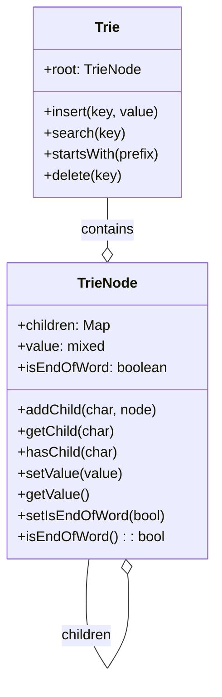
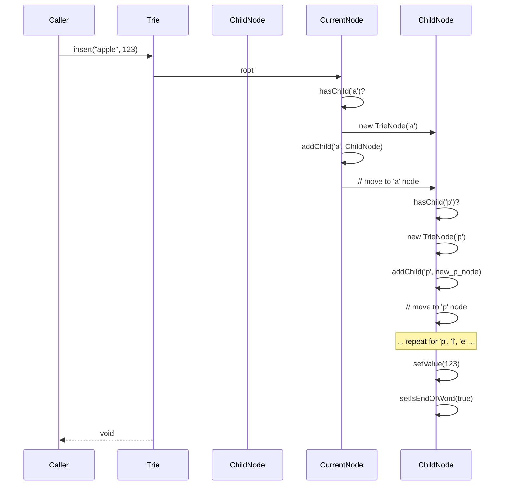
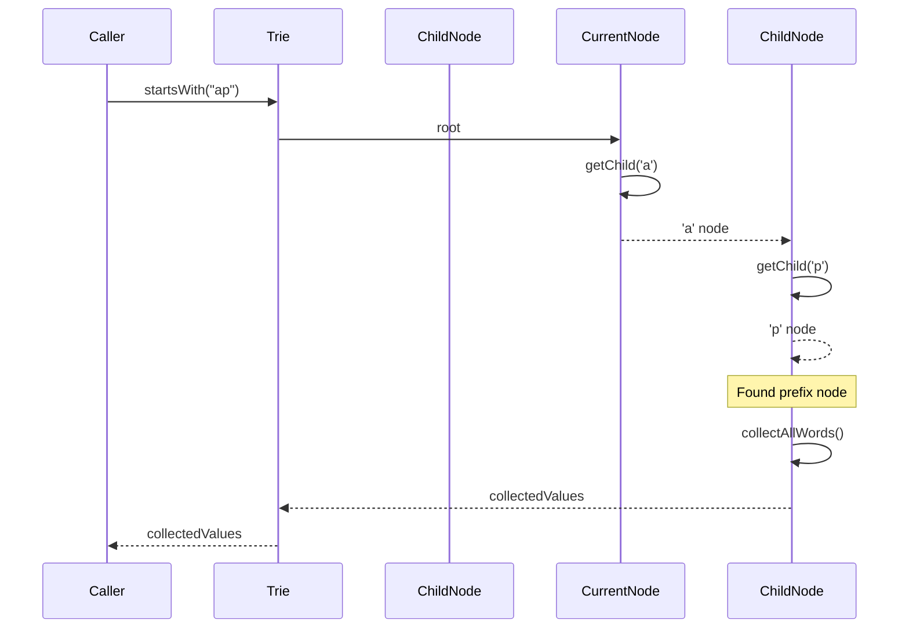

# Prefix Tree (Trie)

A Prefix Tree, also known as a Trie (pronounced "try" from retrieval), is a tree-like data structure used to store a dynamic set or associative array where the keys are usually strings. It is particularly efficient for operations involving prefixes, such as searching for keys with a common prefix, autocomplete, and spell checking.

---

## 1. Overview and Concepts

### What is a Trie?

Unlike a binary search tree where nodes store entire keys, in a Trie, each node typically represents a single character (or a segment of a key). The path from the root to a node represents a prefix of a key. Values are usually stored at the nodes that mark the end of a complete key.

### Key Characteristics:

*   **Nodes as Characters/Segments:** Each node in the tree represents a character or a part of a key. The children of a node are typically stored in a map or array, indexed by the next character in the sequence.
*   **Paths as Prefixes:** A path from the root to any node forms a prefix. If a node marks the end of a valid key, it's often flagged (e.g., `isEndOfWord` boolean) and may store an associated value.
*   **Efficiency for Prefix Operations:** Tries excel at finding all keys that share a common prefix. To do this, you simply traverse the tree along the path defined by the prefix, and then collect all keys (and their values) in the subtree rooted at the node where the prefix ends.
*   **Space-Time Trade-off:** Tries can be very fast for searches (especially prefix searches) but may consume more memory than hash tables for storing the same set of keys, particularly if keys do not share many common prefixes.

### Comparison to Hash Maps for Prefix Search:

While hash maps (like PHP's associative arrays) offer average O(1) time complexity for exact key lookups, they are not efficient for prefix searches. To find all keys with a common prefix in a hash map, you would typically have to iterate through all keys and check each one using string functions like `str_starts_with()`. This is an O(N) operation (where N is the number of keys). A Trie, on the other hand, can perform prefix searches in O(L) time (where L is the length of the prefix), making it significantly faster for large datasets with many common prefixes.

### Conceptual Flow: Insertion

```mermaid
graph TD
    A[Start Insert(key, value)] --> B{Is key empty?};
    B -- Yes --> C[Set value at current node, Mark as end of word];
    B -- No --> D[Get first char of key];
    D --> E{Does current node have child for char?};
    E -- No --> F[Create new child node for char];
    E -- Yes --> G[Move to child node];
    F --> G;
    G --> H[Remove first char from key];
    H --> B;
    C --> I[End];
```

---

## 2. Outline of Properties and Methods

### `TrieNode` Class

Represents a single node within the Trie.

*   **Properties:**
    *   `children`: An associative array (or map) where keys are characters and values are `TrieNode` objects. Stores references to child nodes.
    *   `value`: `mixed` (optional). The value associated with the key that ends at this node. Only set if `isEndOfWord` is true.
    *   `isEndOfWord`: `boolean`. A flag indicating whether a complete key ends at this node.

*   **Methods:**
    *   `addChild(string $char, TrieNode $node)`: Adds a child node for a given character.
    *   `getChild(string $char)`: Retrieves the child node for a given character.
    *   `hasChild(string $char)`: Checks if a child node exists for a given character.
    *   `setValue(mixed $value)`: Sets the value associated with this node.
    *   `getValue()`: Retrieves the value associated with this node.
    *   `setIsEndOfWord(bool $flag)`: Sets the `isEndOfWord` flag.
    *   `isEndOfWord(): bool`: Checks the `isEndOfWord` flag.

### `Trie` Class

Represents the entire Prefix Tree.

*   **Properties:**
    *   `root`: `TrieNode`. The root node of the Trie.

*   **Methods:**
    *   `insert(string $key, mixed $value)`: Inserts a new key-value pair into the Trie.
    *   `search(string $key)`: Searches for a key and returns its associated value, or `null` if not found.
    *   `startsWith(string $prefix)`: Returns an array of all key-value pairs that start with the given prefix.
    *   `delete(string $key)`: Deletes a key-value pair from the Trie.

### Class Diagram:



---

## 3. Sample Code in PHP

Here's a simplified PHP implementation of a Trie, focusing on `insert` and `startsWith` for string keys.

```php
<?php

class TrieNode
{
    public array $children = [];
    public mixed $value = null;
    public bool $isEndOfWord = false;

    public function __construct()
    {
        $this->children = [];
        $this->value = null;
        $this->isEndOfWord = false;
    }

    public function addChild(string $char, TrieNode $node): void
    {
        $this->children[$char] = $node;
    }

    public function getChild(string $char): ?TrieNode
    {
        return $this->children[$char] ?? null;
    }

    public function hasChild(string $char): bool
    {
        return isset($this->children[$char]);
    }

    public function setValue(mixed $value): void
    {
        $this->value = $value;
    }

    public function getValue(): mixed
    {
        return $this->value;
    }

    public function setIsEndOfWord(bool $flag): void
    {
        $this->isEndOfWord = $flag;
    }

    public function isEndOfWord(): bool
    {
        return $this->isEndOfWord;
    }
}

class Trie
{
    private TrieNode $root;

    public function __construct()
    {
        $this->root = new TrieNode();
    }

    /**
     * Inserts a key-value pair into the Trie.
     *
     * @param string $key The key to insert.
     * @param mixed $value The value associated with the key.
     */
    public function insert(string $key, mixed $value): void
    {
        $currentNode = $this->root;
        foreach (str_split($key) as $char) {
            if (!$currentNode->hasChild($char)) {
                $currentNode->addChild($char, new TrieNode());
            }
            $currentNode = $currentNode->getChild($char);
        }
        $currentNode->setValue($value);
        $currentNode->setIsEndOfWord(true);
    }

    /**
     * Searches for a key in the Trie and returns its associated value.
     *
     * @param string $key The key to search for.
     * @return mixed|null The value if found, otherwise null.
     */
    public function search(string $key): mixed
    {
        $currentNode = $this->root;
        foreach (str_split($key) as $char) {
            if (!$currentNode->hasChild($char)) {
                return null;
            }
            $currentNode = $currentNode->getChild($char);
        }
        return $currentNode->isEndOfWord() ? $currentNode->getValue() : null;
    }

    /**
     * Finds all keys that start with the given prefix and their values.
     *
     * @param string $prefix The prefix to search for.
     * @return array An associative array of matching keys and their values.
     */
    public function startsWith(string $prefix): array
    {
        $currentNode = $this->root;
        foreach (str_split($prefix) as $char) {
            if (!$currentNode->hasChild($char)) {
                return []; // Prefix not found
            }
            $currentNode = $currentNode->getChild($char);
        }

        // Now, collect all words from this node downwards
        $results = [];
        $this->collectAllWords($currentNode, $prefix, $results);
        return $results;
    }

    /**
     * Helper method to recursively collect all words from a given node.
     *
     * @param TrieNode $node The current node.
     * @param string $currentWord The word built so far.
     * @param array $results The array to store results.
     */
    private function collectAllWords(TrieNode $node, string $currentWord, array &$results): void
    {
        if ($node->isEndOfWord()) {
            $results[$currentWord] = $node->getValue();
        }

        foreach ($node->children as $char => $childNode) {
            $this->collectAllWords($childNode, $currentWord . $char, $results);
        }
    }
}

// --- Example Usage ---
$trie = new Trie();
$trie->insert("apple", "A fruit");
$trie->insert("apricot", "Another fruit");
$trie->insert("apply", "A verb");
$trie->insert("banana", "Yellow fruit");

echo "Search 'apple': " . ($trie->search("apple") ?? "Not found") . "\n";
echo "Search 'app': " . ($trie->search("app") ?? "Not found") . "\n";

echo "\nWords starting with 'ap':\n";
print_r($trie->startsWith("ap"));

echo "\nWords starting with 'b':\n";
print_r($trie->startsWith("b"));

?>
```

---

## 4. Interaction Diagrams

### Sequence Diagram: `Trie::insert()`



### Sequence Diagram: `Trie::startsWith()`


