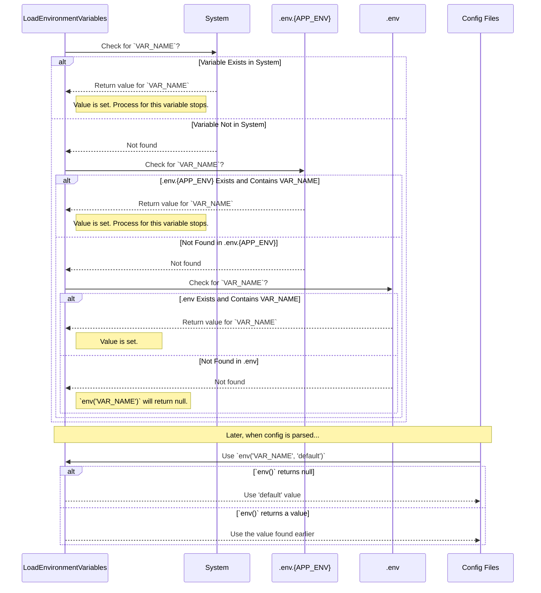

# Laravel Environment Loading Order

This document outlines the order of operations Laravel follows when loading environment variables and resolving configuration values.

## Overview of Loading Precedence

Laravel has a clearly defined hierarchy for loading environment variables. The first value it finds for a given variable is the one it uses. It will not override a loaded value with one from a lower-precedence source.

The order is as follows:

1.  **System-Level Environment Variables**: Any variables set directly on the server (e.g., in your Nginx or Apache config) or in your shell session are checked first and will always take highest priority.
2.  **Environment-Specific `.env` File**: If an `APP_ENV` variable is set (e.g., to `testing` or `production`), Laravel will look for a corresponding file like `.env.testing`. If this file exists, its values are loaded.
3.  **Default `.env` File**: If no `APP_ENV` is set or the environment-specific file doesn't exist, Laravel loads the standard `.env` file from the project root.

## The Role of Configuration Files

If a variable is not found in any of the sources above, Laravel does not have a core fallback. Instead, the fallback mechanism is handled inside the `config/*.php` files, where a default value is provided as the second argument to the `env()` helper function.

```php
// Example from config/database.php
'host' => env('DB_HOST', '127.0.0.1'), // '127.0.0.1' is the fallback
```

---

## Sequence Diagram

This diagram illustrates the decision-making process during the `LoadEnvironmentVariables` bootstrap stage.



---

### The `.env.example` File

The `.env.example` file is **never read** by Laravel. It serves only as a template for developers, showing which variables are required for the application to run.
