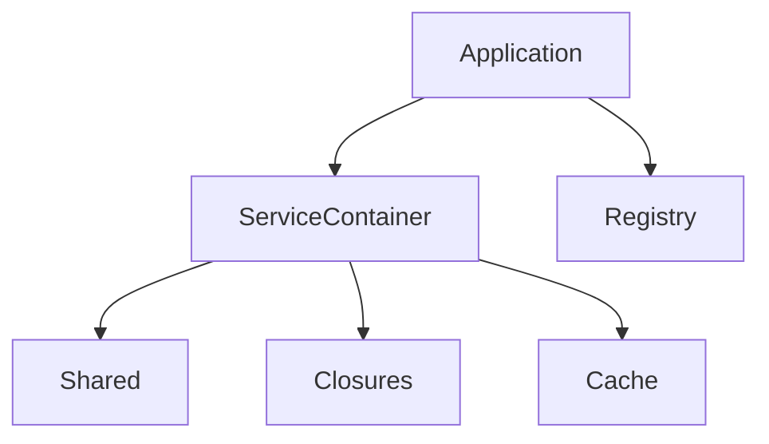
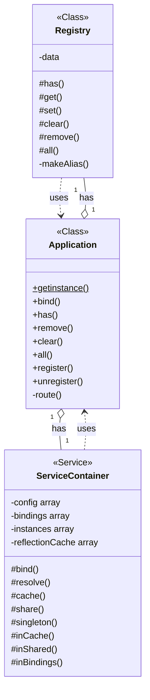
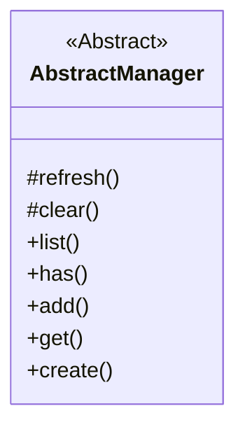
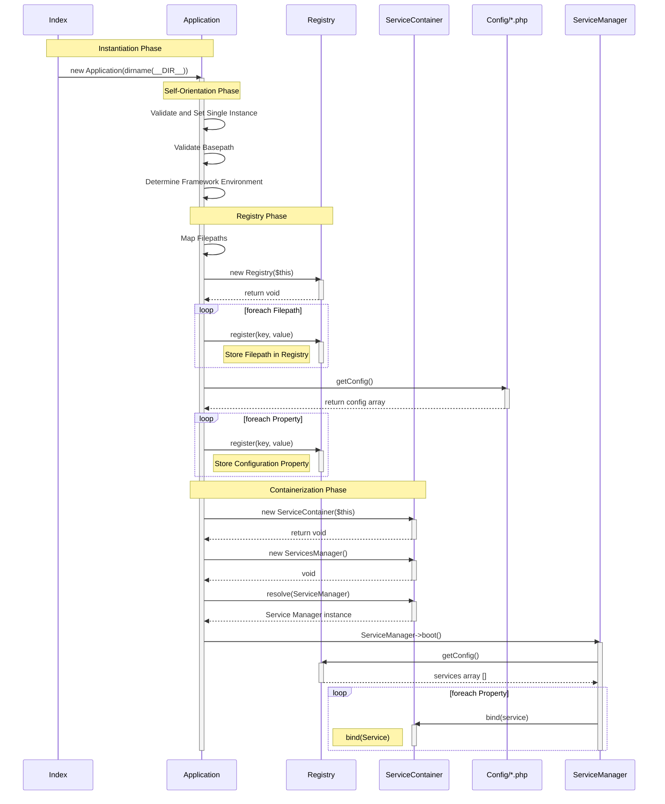

# Application Class

This is the Core of the MVC Framework

## 1.0 Properties

**Path and URL Management**

- [x] **rootDir:** The root directory of your Laravel project.
- [x] **appPath:** The path to the app directory.
- [x] **configPath:** The path to the config directory.
- [x] **databasePath:** The path to the database directory.
- [x] **publicPath:** The path to the public directory.
- [x] **storagePath:** The path to the storage directory.
- [x] **resourcePath:** The path to the resources directory.

**Service and Container State**
- [ ] **serviceProviders:** An array of all the service provider instances that have been registered.
- [ ] **loadedProviders:** A simple array keeping track of which provider classes have already been loaded, to prevent duplication.
- [ ] **deferredServices:** An array that maps deferred services to the provider that registers them. 
- [ ] **cache** Array of auto-wired class instances from Reflection Class
- [ ] **bindings** Main Dependency Injection Container for closures
- [ ] **shared** Main Dependency Injection Container for Singletons / Shared Instances

**State and Lifecycle Flags**
- [ ] **hasBeenBootstrapped** - Boolean value set to true when application has been bootstrapped
- [ ] **bootingCallbacks** - Array that holds any closures or actions that need to be when `$booted = false` 
- [ ] **bootedCallbacks** - Array that holds any closures or actions that need to be when `$booted = true`
- [ ] **booted** - Boolean value indicating that all ServiceProviders have been booted

**MVCFramework Variables**
- [ ] **MCV_TYPE** String with possible values: `local`, `production`, `dev`

**Environmental Variables**
- [ ] **ENV_TYPE** - String with possible values: `local`, `production`, `dev`
- [ ] **ENV_FILEPATH** - ??
- [ ] **ENV_LOCALE** - Current location for localization
- [ ] **ENV_TIMEZONE** - Current Timezone for configurations
- **Database ENV Variables:**
  - [ ] **DB_CONNECTION**
  - [ ] **DB_HOSTTYPE**
  - [ ] **DB_PORTNUM**
  - [ ] **DB_DATABASE**
  - [ ] **DB_USERNAME**
  - [ ] **DB_PASSWORD**
  - [ ] **DB_CHARSET**
  - [ ] **DB_OPTIONS**

### 2.0 Methods
- [ ] **Configure**
  - [ ] Sets and validates filepaths and file structure
  - [ ] Instantiates Classes necessary for configuration
    - [ ] DotEnv
    - [ ] Utility
---

### 3.0 Lifecycle

#### 3.0.1 Overview of Laravel Lifecycle

1. Request Entry Point `public/index.php`
2. Load `bootstrap/app.php`
3. Create *Application* Instance
4. *Http Kernel* Takes over and processes incoming http request
   1. RegisterProviders called by HttpKernel inside *handle()* method which handles http requests
   2. Contains property $bootstrappers array
5. *Bootstrappers* run including *RegisterProviders* class
   1. Runs *register()* methods of all providers first
   2. Runs *boot()* methods of all providers second
      1. Includes *RegisterFascades* register() and boot() methods
6. 

---

#### 3.0.2 Actual Lifecycle of MVC Framework: Overview


#### 3.0.3 Actual Lifecycle of MVC Framework: Granular
1. Request Entry Point `public/index.php`
2. Load `bootstrap/app.php`
3. Create *Application* Instance `$app = new Application(dirname(__DIR__))`
   1. `__construct()` 
      1. Validate Instance Count
      2. Property startTime set with `microtime`
      3. `$this->configureApplication()`
         1. Define and Validate *Project Root Directory*
         2. Determine Environment of MVCFramework
         3. Instantiate *PathRegistry*
            1. Register Required User Paths with PathRegistry
            2. Register Configuration Paths with PathRegistry
         4. Instantiate *DotEnv* and load environment variables
         5. Instantiate *FascadeManager*
         6. Instantiate *HttpCore*
      4. Parent *Container* `parent::__construct()`
         1. Creates Container instance
         2. Creates ReflectionCache instance
4. Runtime:
   1. Http Request Made

#### 3.1 Application Instantiation and Root Directory Path Definition
- [x] User defines **Bootstrap** directory in root: `~/bootstrap/`
- [x] User instantiates **Application** instance and passes `dirname(__DIR__)` in: `~/bootstrap/app.php`
  ```php
  $app = new MVCFramework\Foundation\Application(
    dirname(__DIR__) // Ponts to parent directory of /bootstrap which must be the root directory
  );
  ```
  - [ ] To override a path: `$app->usePathnamePath("/path/to/dir);`
- [x] Application configures filepaths based on **Convention** and the **root path** from `dirname(__DIR__)`
  - [x] Validate filepaths
  - [x] Validate directories exist
    - [ ] Check if different paths defined with `$app->useFP...` methods

#### 3.2 Instantiate Classes Necessary for Configuration
- [x] Create DotEnv and Utility Class Instances
- [x] Load ENV File and populate ENV Variables
  - [x] Validate Necessary Variables only
  - [x] Populate Necessary Variables only
  - [x] Share Necessary Variables only

#### 3.3 


## Appendix A: Features to be added

Potential, Optional, and Definite Features to be added

### A.1 ENV Class
- [ ] Class for Managing ENV Files and Variables
- **Properties**
  - [ ] keys - An array of expected env variables keyed by group
- **Methods**
  - [ ] Validate ENV Variables
  - [ ] Validate ENV Path
  - [ ] Load ENV Variable
  - [ ] Load ENV Variable Group
  - [ ] Determine if DB variables needed (check if DB / ORM Used)
  - [ ] getENV
  - [ ] setENV
  - [ ] hasENV
- [ ] Instance created as property of Application
- [ ] 

---

### A.2 Utility Class
- [ ] Utility Class
    - Helper Function `utils()`
    - Static Class / Singleton
    - Unregisted: does not need to be a service or injected into Container
    - Instance Created by **Application** Class
    - **Properties**
      - [ ] env_locale
      - [ ] env_timezone
    - **Methods**
    - [ ] getTS / get TimeStamp

---

# Appendix B: Directory Structures

## B.1 User Application Environment

```
my-mvcframe-project/
├── 📁 app/                 User's Application Code
│   ├── 📁 Http/
│   │   └── 📄 Controllers/
│   ├── 📁 Models/
│   └── 📁 Providers/
│
├── 📁 bootstrap/           Bootstrap Directory MUST be inside Root Directory
│   ├── 📁 cache/           
│   └── 📄 app.php          Application Instantiation with dirname(__DIR__)
│
├── 📁 config/              User's Application Configuration Files
│   ├── 📄 .env                 > Environmental Variables
│   ├── 📄 app.php
│   ├── 📄 database.php
│   └── 📄 view.php
│
├── 📁 public/              Web-root
│   ├── 📄 index.php            > Single public entry-point    
│   └── 📄 assets/              
│
├── 📁 resources/           Uncompiled Resources
│   ├── 📁 css/
│   ├── 📁 js/
│   └── 📁 views/          
│
├── 📁 routes/             Route definitions for Router
│   ├── 📄 api.php
│   └── 📄 web.php
│
├── 📁 storage/            Application Generated Files
│   ├── 📁 app/
│   ├── 📁 framework/
│   └── 📁 logs/
│
├── 📁 tests/              Application Tests
│
├── 📁 vendor/ 
│   └── 📁 mvc-frame/      MVC Framework
│       ├── 📁 docs/
│       ├── 📁 src/
│       ├── 📁 tests/
│       ├── 📄 composer.json/
│       └── 📄 README.md
├── 📄 composer.json
└── 📄 package.json

```


## B.2 Testing Directory Environment
```
.
│
├── 📁 docs/
├── 📁 src/
│
├── 📁 tests/
│   ├── 📁 bootstrap/
│   │   ├── 📁 stuff/
│   │   ├── 📄 .env      Testing Environmental Variables
│   │   └── 📄 app.php   Application Instance
│   │
│   ├── 📁 Services/
│   ├── 📁 Models/
│   ├── 📁 Repositories/
│   ├── 📁 Controllers/
│   ├── 📁 Routes/
│   ├── 📁 Config/
│   │
│   ├── 📁 Cars/
│   ├── 📁 Classes/
│   ├── 📁 Interfaces/
│   ├── 📁 Fascades/
│   ├── 📁 Turducken/
│   ├── 📄 CarFactory.php
│   ├── 📄 Constants.php
│   └── 📄 main.php      Application Entry Point and Testing-ground
│
├── 📄 composer.json/
└── 📄 README.md

```
# Appendix C: Organizational and Class Diagrams

## C.1 Existing Framework

### C.1.1 Class Diagram: Existing

## C.2 Restructured Framework

### C.2.1 Organizational Chart: Restructure



### C.2.2 Class Diagrams: Restructure

#### C.2.2.1 Application Structure



#### C.2.2.3 Manager Interface to Manager



---

## C.4 Sequences

### C.4.1 Application Instantiation & Self-Orientation

