# Mermaid Diagrams Reference

## 1.0 Class Diagrams

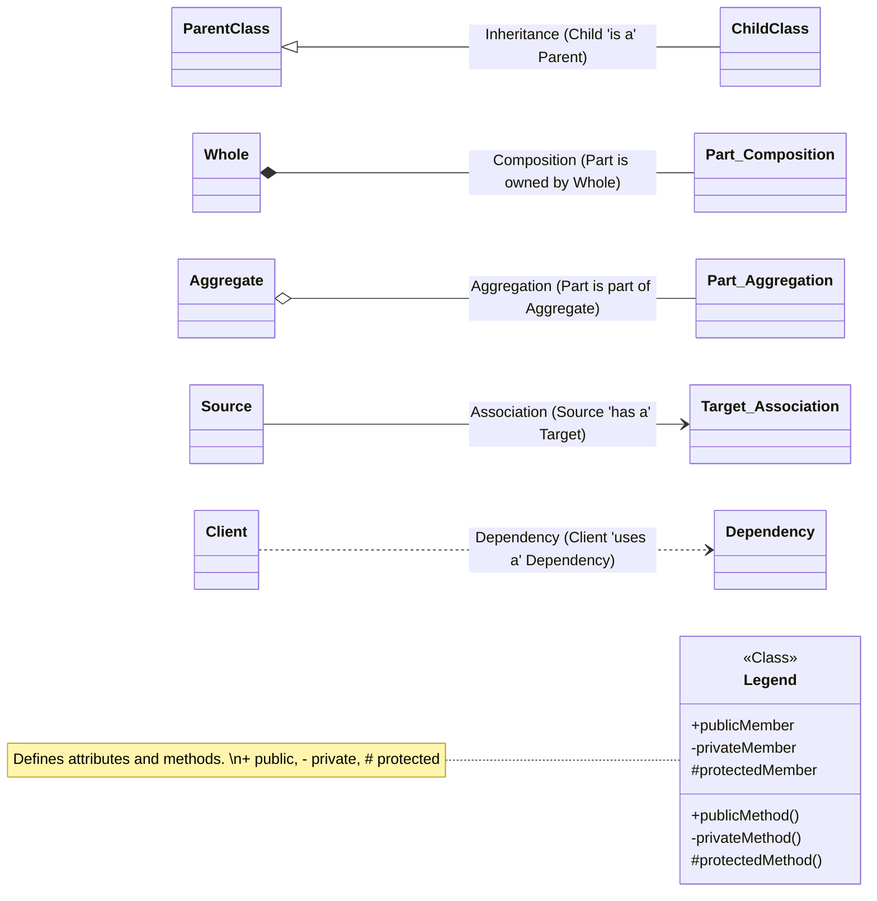

## 2.0 Organizational Charts

### 2.1 Top-Down
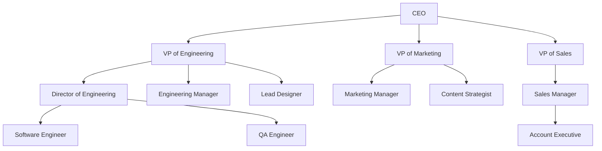

### 2.2 Subgraphs
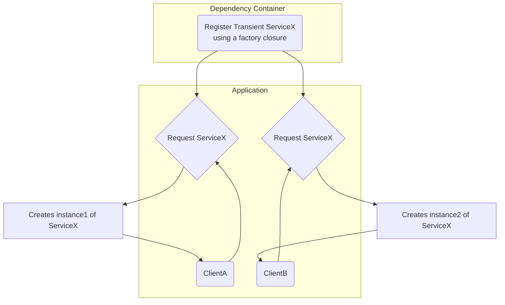

## 3.0 UML Sequence Diagrams

### 3.1 Example 1
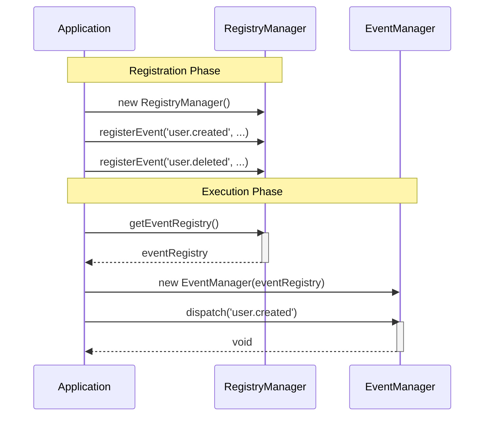

### 3.2 Example 2

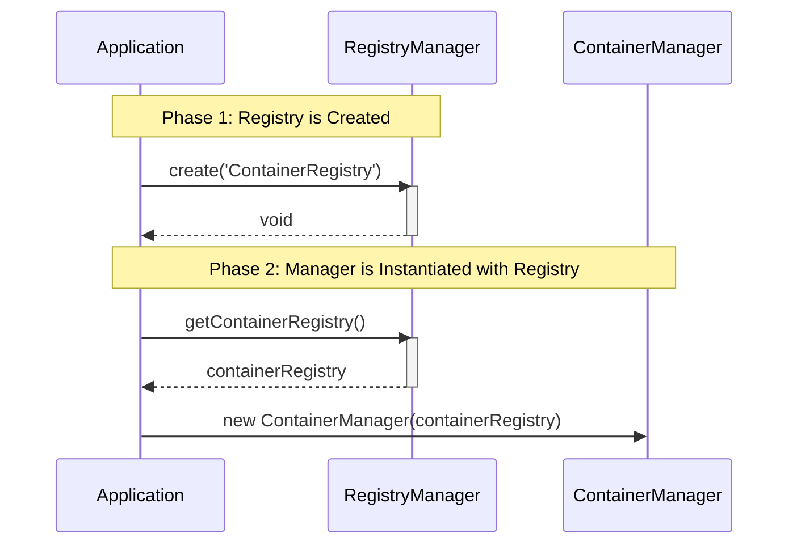

### 3.3 Example 3

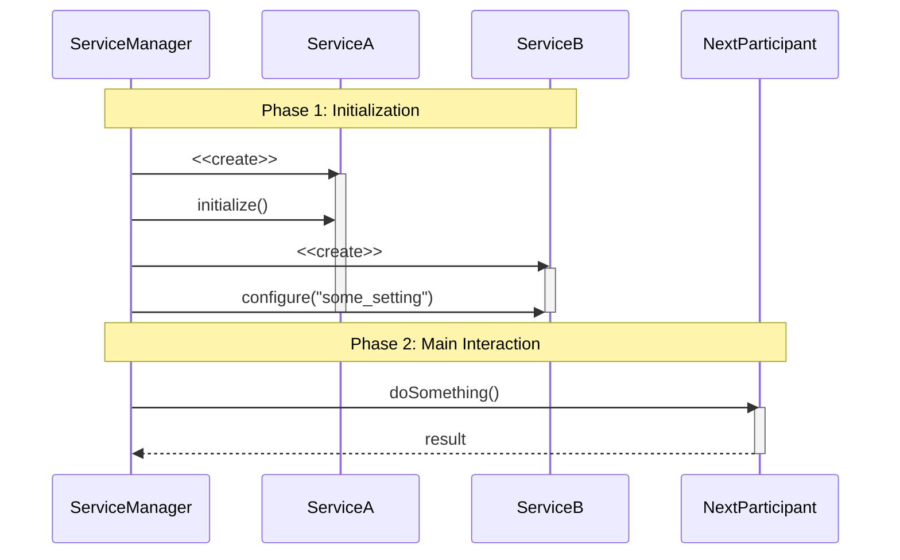

#### 3.4 Example 4

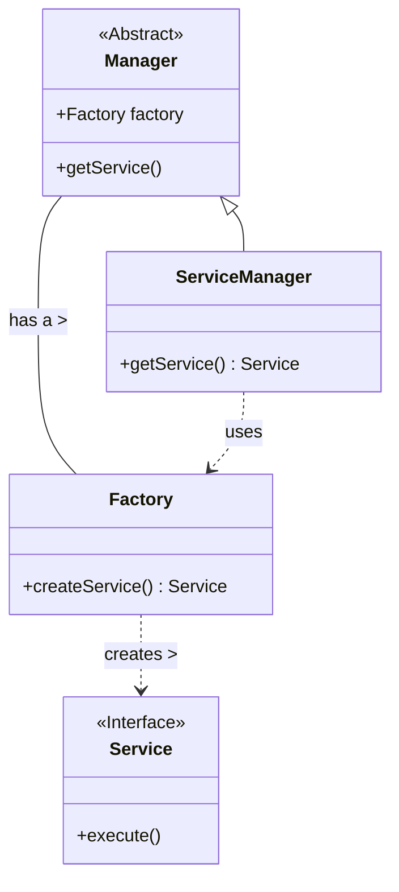

#### 3.5 Example 5
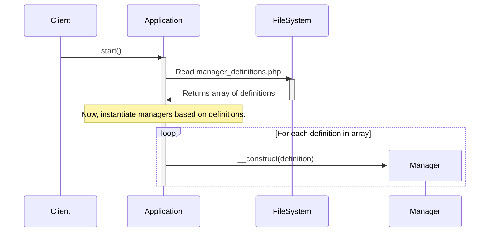

#### 3.6 Example 6

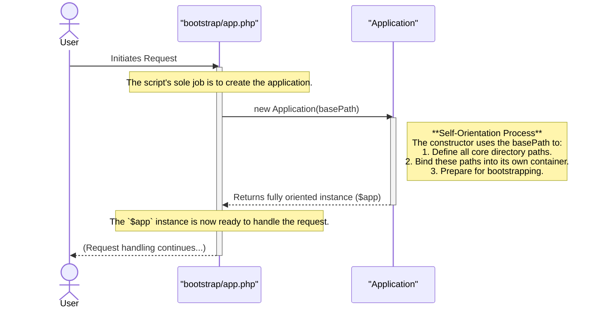

#### 3.7 Example 7
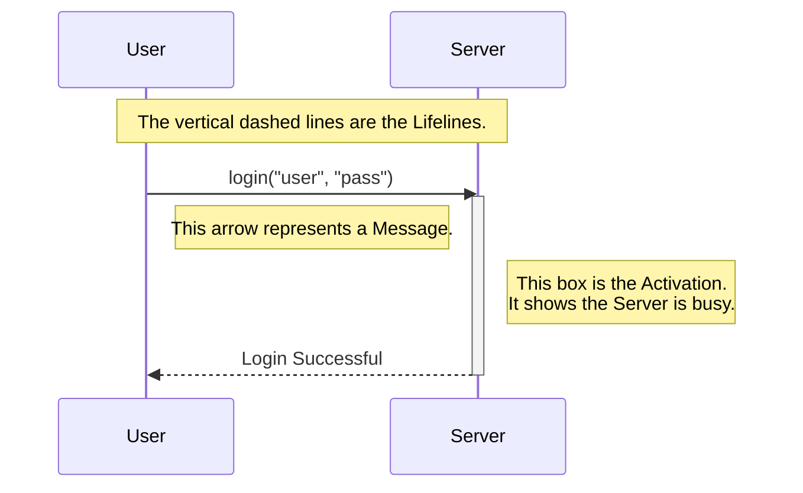

#### 3.8 Example 8
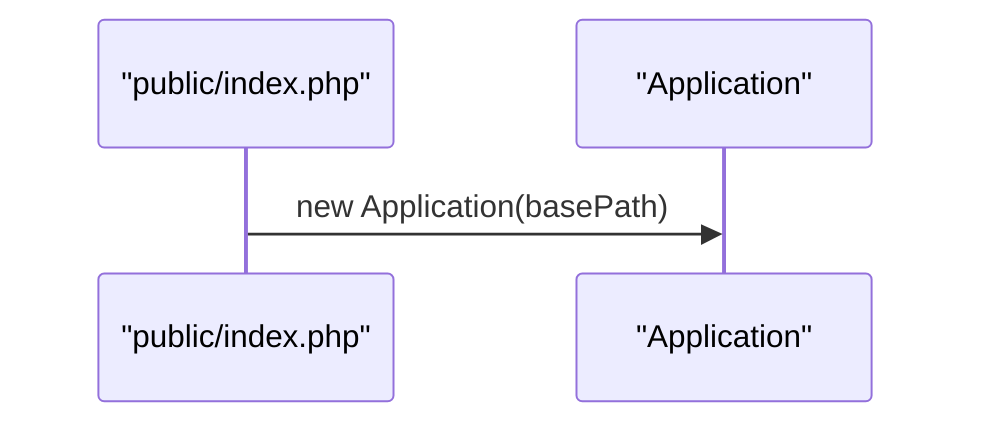

#### 3.9 Example 9
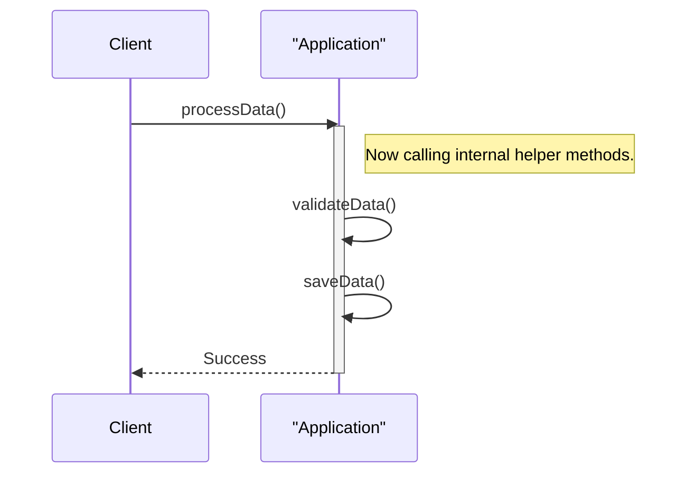

#### 3.10 Example 10
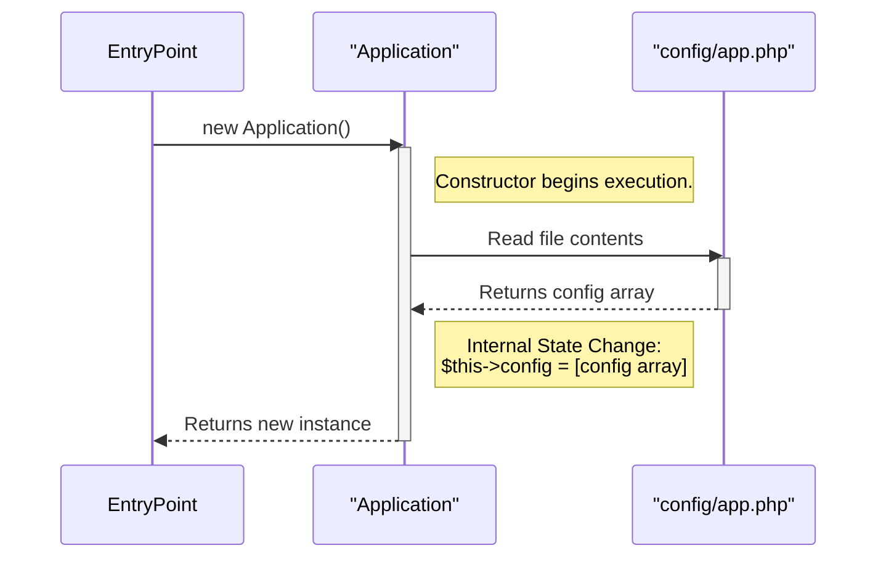

#### 3.11 Example 11
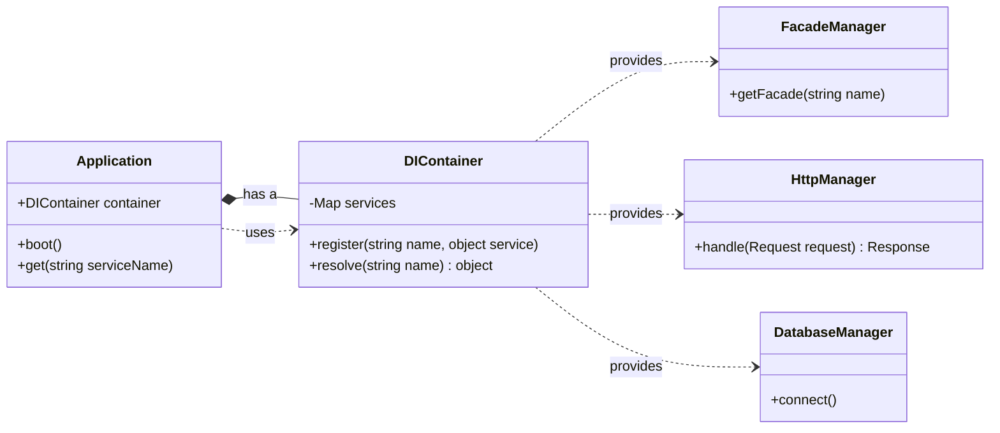

#### 3.12 Example 12
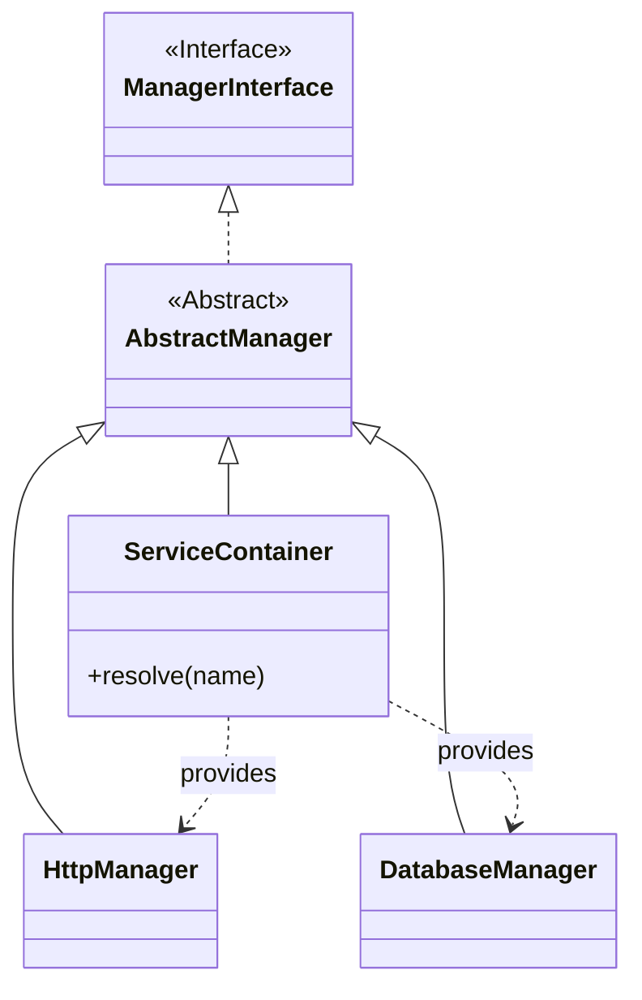

#### 3.13 Example: Association Between Classes
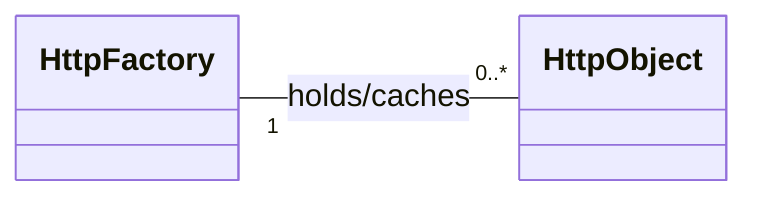

#### 3.14 Example: Composition Relationship

*A part cannot exist independently of the whole*

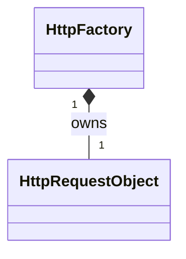

#### 3.15 Example: Factory as a Gateway

*Ownership Chain composition and Access Path dependency*

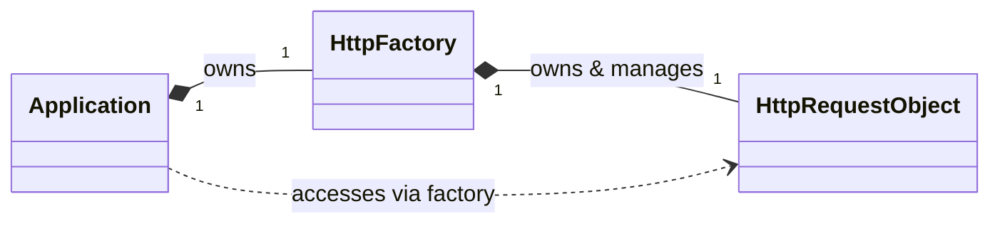

#### 3.16 Example: Factory Managed by a DI Container

- *Application to Container: Composition*
- *Container to HttpFactory: Dependency (Provides)*
- *HttpFactory to HttpReqObj: Composition*
- *Application to HttpFactory: Dependency (Resolves)*

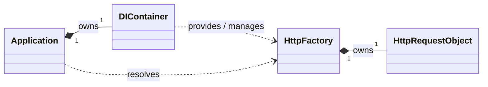

#### 3.17 Example: Gateway Architecture

*Gateway Architecture*

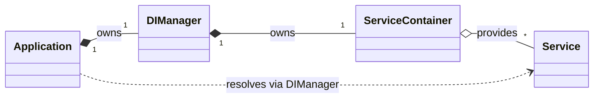

#### 3.18: Provides multiple with interface
```mermaid
classDiagram
    class ServiceContainer
    interface IService

    class Service A {<<Service>>}
    class Service B {<<Service>>}

    IService <|.. ServiceA
    IService <|.. ServiceB

    ServiceContainer o-- "*" IService: provides
```

#### 3.19 Example: Composition and Creation and Management

```mermaid
  classDiagram
    class CarFactory {
      -cars: Car[]
      +createCar(): Car
      +getCar(): Car
    }

    class Car {
      -model: string
      +drive()
    }

    CarFactory ..> Car : << create >>
```

---

## 4.0 Flowchart

```mermaid
graph TD
    subgraph "Phase 1: Registration"
        A[Start] --> B(Create RegistryManager);
        B --> C{Define Events/Routes};
        C --> D[app.registerEvent];
        D --> C;
    end

    subgraph "Phase 2: Execution"
        C --> E[Create EventManager];
        E --> F(Inject Registry into EventManager);
        F --> G[app.dispatch];
        G --> H[End];
    end
```