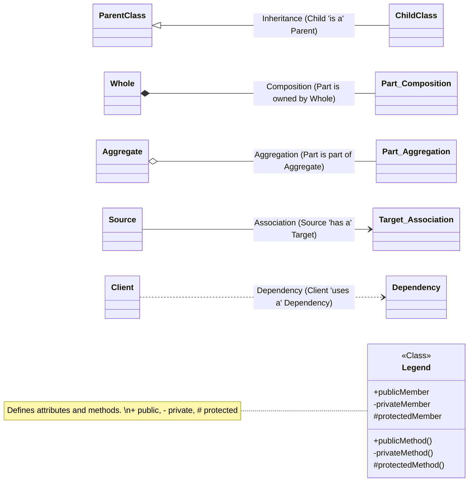
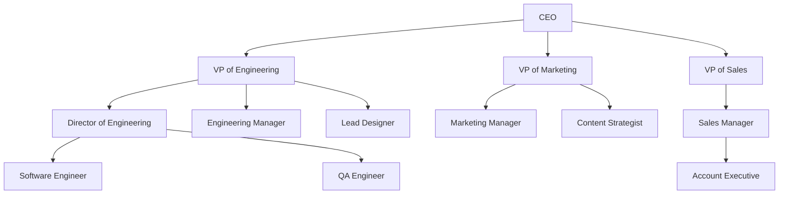
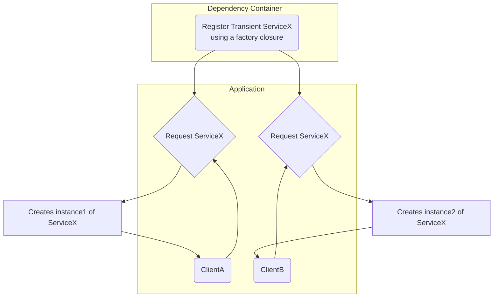

# Mermaid Diagrams Reference

## 1.0 Class Diagrams

```mermaid
classDiagram
    direction LR

    class Legend {
        <<Class>>
        +publicMember
        -privateMember
        #protectedMember
        +publicMethod()
        -privateMethod()
        #protectedMethod()
    }
    note for Legend "Defines attributes and methods. \n+ public, - private, # protected"

    class ParentClass
    class ChildClass

    class Whole
    class Part_Composition

    class Aggregate
    class Part_Aggregation

    class Source
    class Target_Association

    class Client
    class Dependency

    ParentClass <|-- ChildClass : Inheritance (Child 'is a' Parent)
    Whole *-- Part_Composition : Composition (Part is owned by Whole)
    Aggregate o-- Part_Aggregation : Aggregation (Part is part of Aggregate)
    Source --> Target_Association : Association (Source 'has a' Target)
    Client ..> Dependency : Dependency (Client 'uses a' Dependency)
```

## 2.0 Organizational Charts

### 2.1 Top-Down

```mermaid
graph TD;
    %% Define Nodes (Positions)
    A[CEO]

    B[VP of Engineering]
    C[VP of Marketing]
    D[VP of Sales]

    E[Director of Engineering]
    F[Engineering Manager]
    G[Lead Designer]

    H[Marketing Manager]
    I[Content Strategist]

    J[Sales Manager]
    K[Account Executive]
    
    L[Software Engineer]
    M[QA Engineer]

    %% Connect Nodes (Reporting Structure)
    A --> B;
    A --> C;
    A --> D;

    B --> E;
    B --> F;
    B --> G;

    E --> L;
    E --> M;
    
    C --> H;
    C --> I;

    D --> J;
    J --> K;
```

### 2.2 Subgraphs

```mermaid
graph TD;
    subgraph Dependency Container
        A(Register Transient ServiceX <br> using a factory closure)
    end

    subgraph Application
        B(ClientA) --> C{Request ServiceX};
        D(ClientB) --> E{Request ServiceX};
    end

    A --> C;
    A --> E;

    C --> F[Creates instance1 of ServiceX];
    E --> G[Creates instance2 of ServiceX];

    F --> B;
    G --> D;
```