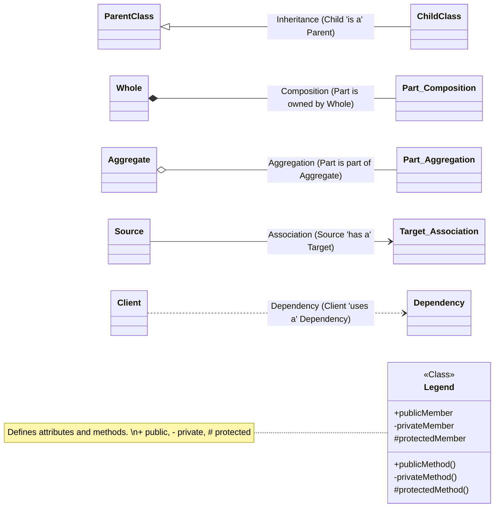
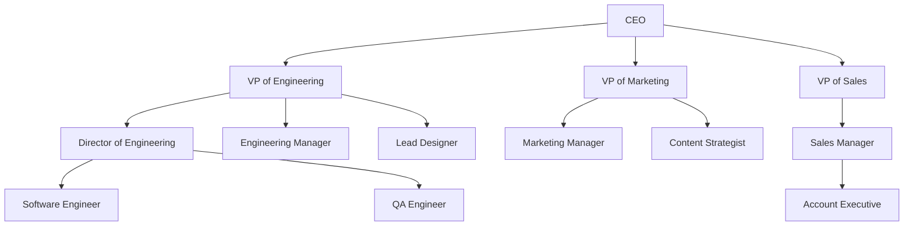
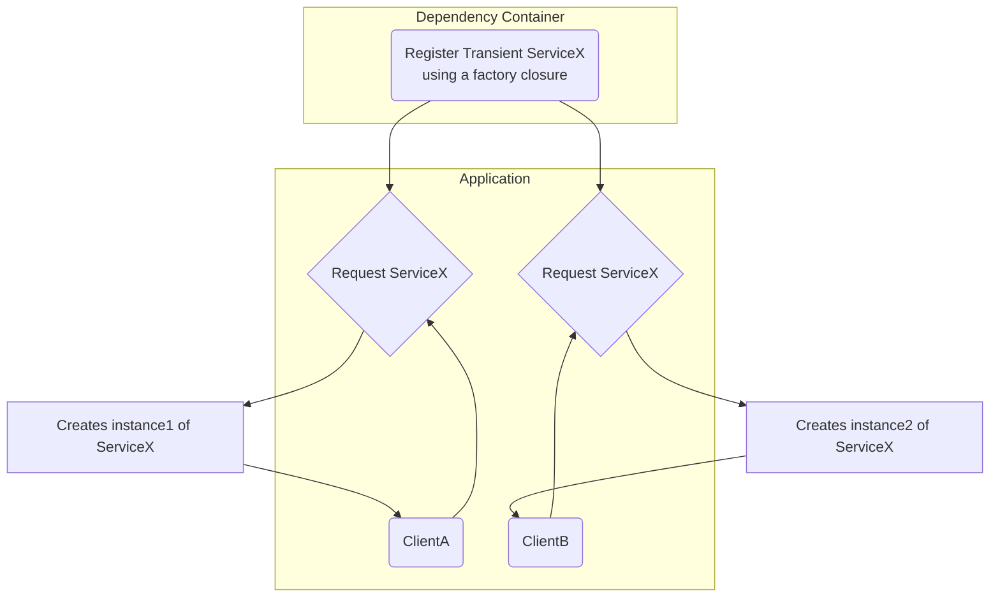
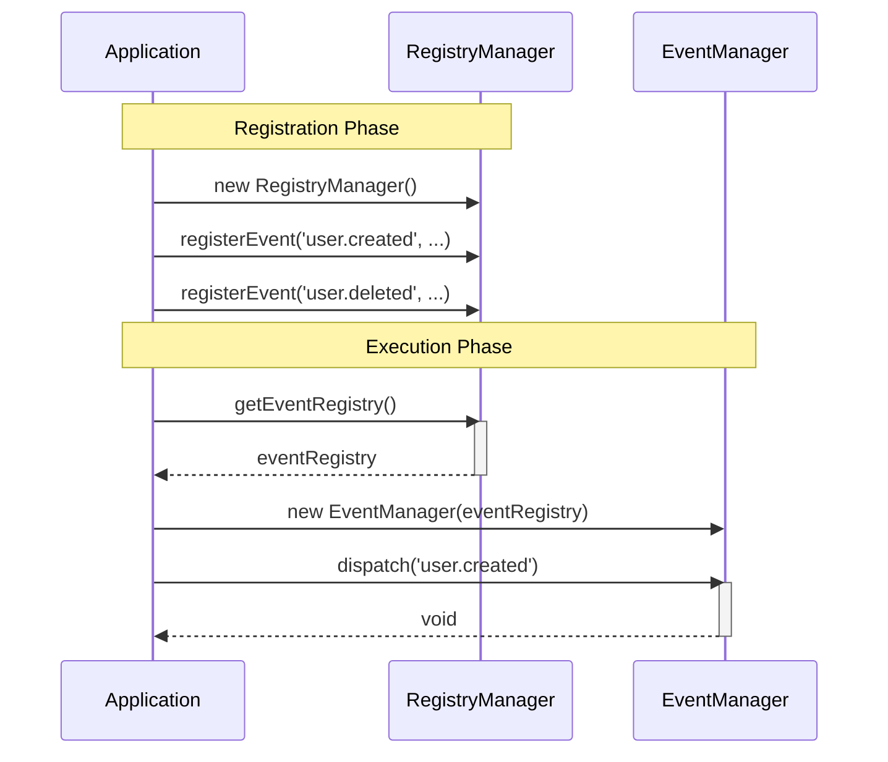
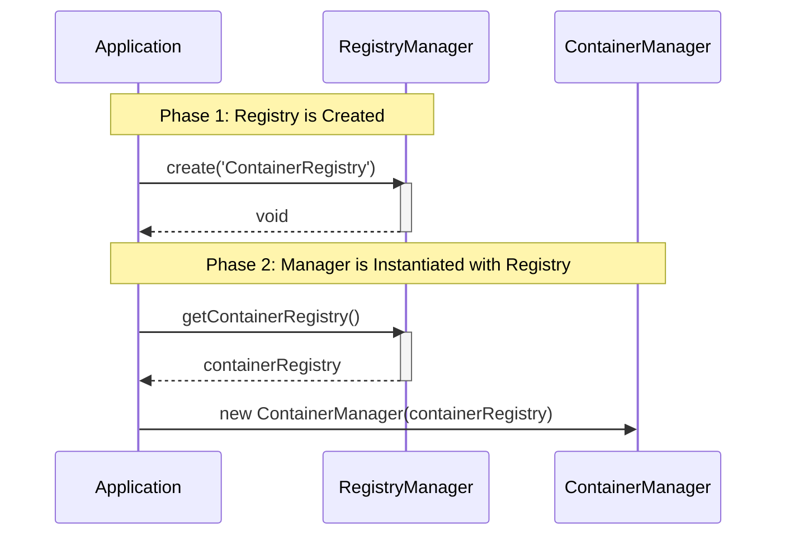
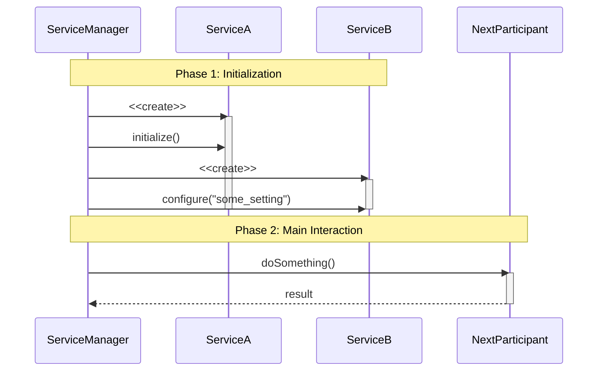
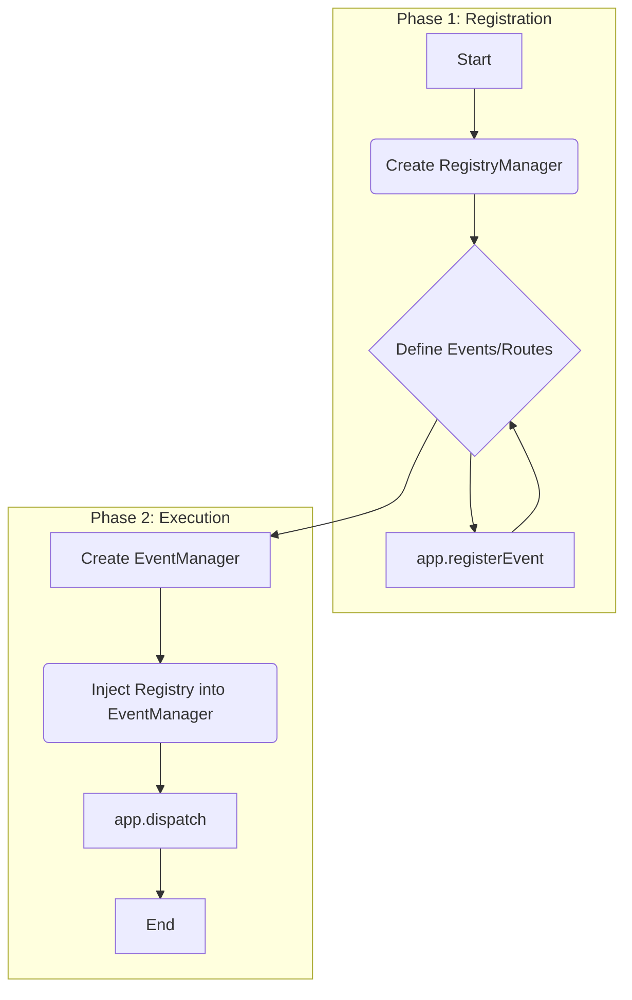

# Mermaid Diagrams Reference

## 1.0 Class Diagrams

## 2.0 Organizational Charts

### 2.1 Top-Down

### 2.2 Subgraphs

## 3.0 UML Sequence Diagrams

### 3.1 Example 1

### 3.2 Example 2

### 3.3 Example 3

## 4.0 Flowchart

