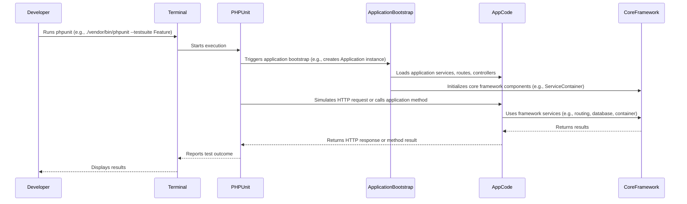

# Feature Testing Your Application (Skeleton)

Feature tests (also known as integration tests) verify that different components of your application work together correctly. These tests typically involve bootstrapping your entire application and simulating user interactions, such as making HTTP requests.

## Composer Considerations

Your `skeleton/composer.json` will require your `core` framework package. When running feature tests, Composer ensures that both your application's code and your core framework's code are correctly autoloaded.

*   **`composer.json` in `skeleton/`:** This file defines the application's dependencies, including your `my-framework/core` package. It also defines the `autoload` and `autoload-dev` sections for your application's specific code (e.g., `App\\` namespace pointing to `app/`).
*   **Path Repository:** During development, your `skeleton/composer.json` will use a `path` repository to link to your local `core/` directory, ensuring that changes in your framework are immediately available for testing.

## Feature Testing Workflow Sequence

This diagram illustrates the typical flow when running feature tests for your application.



## Example Feature Test

Here's a simple example of a feature test for a hypothetical web route in your application, using PHPUnit and assuming your application has a basic `TestCase` that bootstraps the application.

```php
// skeleton/tests/Feature/HomePageTest.php
<?php

namespace App\Tests\Feature; // Assuming App is your application's namespace

use PHPUnitramework\TestCase;
// Assuming you have a base TestCase that sets up the application
// For Laravel, this would be Tests\TestCase
// For your framework, you'd create a similar base class
use App\Tests\TestCase; // Adjust namespace as per your skeleton's test setup

class HomePageTest extends TestCase
{
    /**
     * A basic test example.
     *
     * @return void
     */
    public function testHomePageLoadsSuccessfully()
    {
        // Simulate an HTTP GET request to the '/' route
        // This method would be provided by your base TestCase after bootstrapping the app
        $response = $this->get('/');

        // Assert that the HTTP status code is 200 (OK)
        $this->assertEquals(200, $response->getStatusCode());

        // Assert that the response contains specific text
        $this->assertStringContainsString('Welcome to My Application', $response->getBody());
    }

    public function testAboutPageLoadsSuccessfully()
    {
        $response = $this->get('/about');
        $this->assertEquals(200, $response->getStatusCode());
        $this->assertStringContainsString('About Us', $response->getBody());
    }
}

// skeleton/routes/web.php (example route)
<?php

// Assuming your framework has a Router or similar mechanism
$router->get('/', function() {
    return '<h1>Welcome to My Application</h1>';
});

$router->get('/about', function() {
    return '<h1>About Us</h1>';
});
```

## Best Practices for Organizing Feature Tests

*   **Separate Directory:** Keep feature tests in a separate directory like `tests/Feature` to distinguish them from unit tests.
*   **Realistic Scenarios:** Focus on testing user-facing features and common workflows.
*   **Application Bootstrap:** Feature tests typically require bootstrapping the entire application, including the service container, routing, and database connections. Your base `TestCase` should handle this setup.
*   **Database Management:** If tests interact with a database, use database migrations and seeders to set up a clean state for each test. Use transactions to roll back changes after each test.
*   **Mock External Services:** For external APIs or services, use mocks to prevent actual network calls and ensure tests are fast and reliable.
*   **HTTP Assertions:** Use assertion methods provided by your testing framework (or custom ones in your base `TestCase`) to verify HTTP responses (status codes, headers, content).
