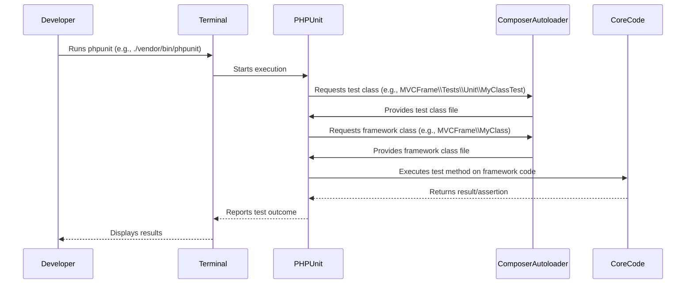

# Unit Testing Your Core Framework

Unit testing is crucial for ensuring the reliability and correctness of individual components of your framework. These tests focus on isolated units of code, typically methods or classes, without external dependencies.

## Composer Considerations

When unit testing your core framework, Composer plays a vital role in autoloading your source code and your test files.

*   **`composer.json` in `core/`:** Your `core/composer.json` should define the `autoload` section for your framework's source code (e.g., `psr-4` for `MVCFrame\\` pointing to `src/`).
*   **`autoload-dev`:** For your unit tests, you'll typically define an `autoload-dev` section in `core/composer.json` (e.g., `psr-4` for `MVCFrame\\Tests\\Unit\\` pointing to `tests/Unit/`). This ensures your test classes are autoloaded only during development and testing.
*   **`composer install`:** Running `composer install` in your `core/` directory generates the `vendor/autoload.php` file, which is essential for loading your framework classes and test classes.

## Unit Testing Workflow Sequence

This diagram illustrates the typical flow when running unit tests for your core framework.



## Example Unit Test

Here's a simple example of a unit test for a hypothetical `Calculator` class in your core framework, using PHPUnit.

```php
// core/src/Calculator.php
<?php

namespace MVCFrame;

class Calculator
{
    public function add(int $a, int $b): int
    {
        return $a + $b;
    }

    public function subtract(int $a, int $b): int
    {
        return $a - $b;
    }
}

// core/tests/Unit/CalculatorTest.php
<?php

namespace MVCFrame\Tests\Unit;

use PHPUnitramework\TestCase;
use MVCFrame\Calculator; // Assuming MVCFrame is your core namespace

class CalculatorTest extends TestCase
{
    public function testAddition()
    {
        $calculator = new Calculator();
        $this->assertEquals(5, $calculator->add(2, 3));
    }

    public function testSubtraction()
    {
        $calculator = new Calculator();
        $this->assertEquals(1, $calculator->subtract(3, 2));
    }

    public function testAdditionWithZero()
    {
        $calculator = new Calculator();
        $this->assertEquals(0, $calculator->add(0, 0));
    }
}
```

## Best Practices for Organizing Unit Tests

*   **Mirror Source Structure:** Organize your `tests/Unit` directory to mirror the directory structure of your `src` directory. For example, if you have `core/src/Http/Request.php`, its unit test would be `core/tests/Unit/Http/RequestTest.php`.
*   **Clear Naming:** Name your test files `ClassNameTest.php` (e.g., `RequestTest.php`) and your test methods `testMethodName()` or `test_method_name()`.
*   **One Class Per Test File:** Generally, have one test class per source class.
*   **Isolation:** Unit tests should be completely isolated. Use mocks and stubs to eliminate external dependencies (database, file system, network, other complex classes).
*   **Fast Execution:** Unit tests should run very quickly. If they are slow, they might be integration tests in disguise.
*   **Assertions:** Use PHPUnit's assertion methods (`assertEquals`, `assertTrue`, `assertInstanceOf`, etc.) to verify expected behavior.
