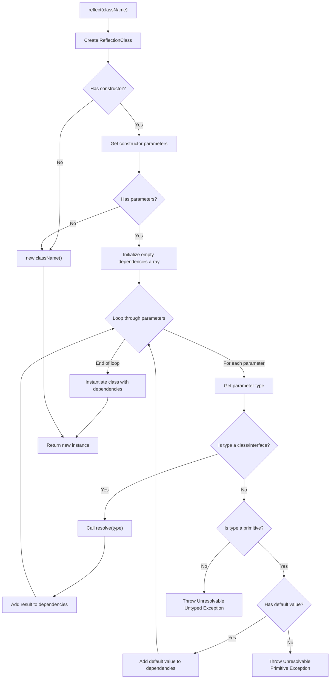

```mermaid
graph TD
    A["reflect(className)"] --> B["Create ReflectionClass"];
    B --> C{"Has constructor?"};
    C -- "No" --> D["new className()"];
    C -- "Yes" --> E["Get constructor parameters"];
    E --> F{"Has parameters?"};
    F -- "No" --> D;
    F -- "Yes" --> G["Initialize empty dependencies array"];
    G --> H{"Loop through parameters"};
    H -- "For each parameter" --> I["Get parameter type"];
    I --> J{"Is type a class/interface?"};
    J -- "Yes" --> K["Call resolve(type)"];
    K --> L["Add result to dependencies"];
    J -- "No" --> M{"Is type a primitive?"};
    M -- "Yes" --> N{"Has default value?"};
    N -- "Yes" --> O["Add default value to dependencies"];
    N -- "No" --> P["Throw Unresolvable Primitive Exception"];
    M -- "No" --> Q["Throw Unresolvable Untyped Exception"];
    L --> H;
    O --> H;
    H -- "End of loop" --> R["Instantiate class with dependencies"];
    R --> S["Return new instance"];
    D --> S;
```
